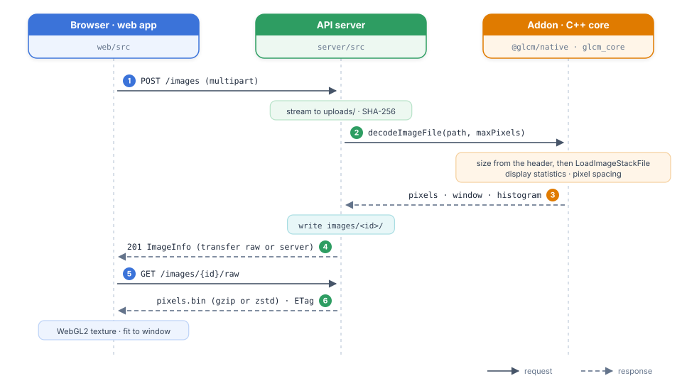
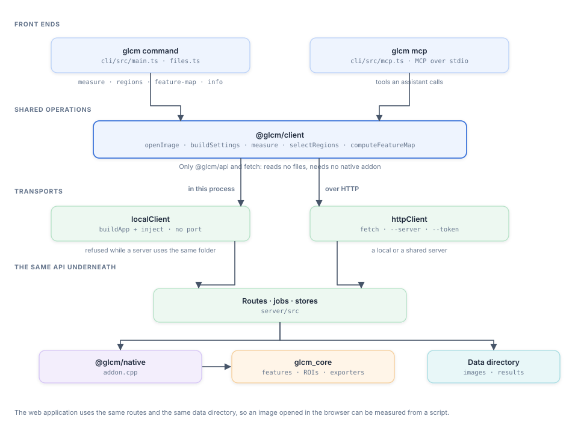
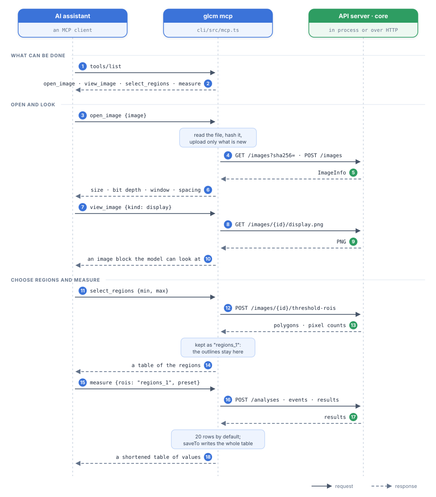
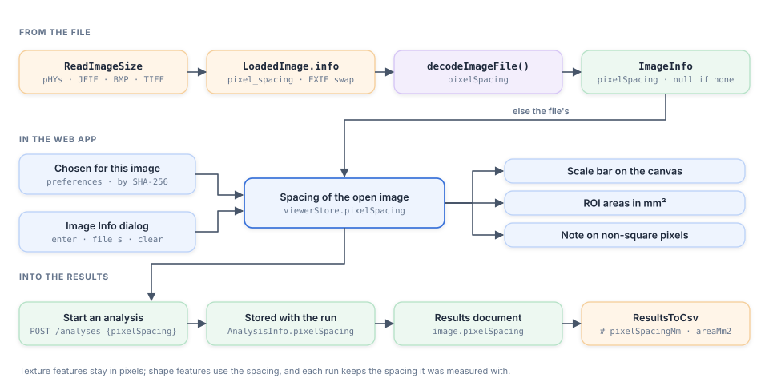

.. _architecture:

Architecture
============

Overview
--------

The application is a client–server web application with the numerical work in a C++ library:

.. figure:: images/architecture-overview.svg
   :alt: The web app in the browser calls the API server over HTTP with JSON, binary pixel data, PNG images and
         Server-Sent Events. The server calls the Node-API addon, which calls the glcm_core C++ library, and stores
         images, results and caches in the data directory. Shared TypeBox schemas provide request validation,
         TypeScript types and the OpenAPI document.
   :align: center
   :width: 100%

   Components of the application. Solid arrows are calls and data; dashed arrows show where the shared schemas are
   used.

- ``glcm_core`` is the single source of the numbers: ROI masks, quantization, GLCM features, the age-based score,
  display rendering and the CSV, JSON and ROI image exporters. It has no UI or web dependencies and is tested with
  GoogleTest.
- The **addon** exposes ``glcm_core`` to Node.js. Slow calls run on worker threads and return promises.
- The **server** stores images and results, runs analyses as jobs, streams progress, produces exports, enforces
  authentication and limits, and serves the built web app.
- The **web app** shows the image, lets users draw and manage ROIs, edit settings, measure and export. It never
  computes features itself, and pixel counts shown in the ROI Manager come from the server. The one mask computed in
  TypeScript is ``shapeRuns`` in ``@glcm/api`` (``roiPixels.ts``), a port of ``RasterizeMask`` for the ImageJ ROI
  writer, which the tests compare with the addon.
- ``@glcm/api`` holds the request and response schemas. The server validates and serializes with them, the OpenAPI
  document is generated from them, and the web app uses their TypeScript types.

The same build runs in two modes (see ``doc/deployment.md``): **local mode** on a loopback address without
authentication, started with ``npm start``, and **server mode** on any other address, which requires an access token
and is usually run with Docker.

Repository layout
-----------------

.. list-table::
   :header-rows: 1
   :widths: 25 75

   * - Path
     - Contents
   * - ``core/``
     - ``glcm_core`` static library (``analysis/``, ``roi/``, ``imaging/``, ``pipeline/``, ``io/``) and ``tests/``
   * - ``bindings/node/``
     - ``@glcm/native``: ``src/addon.cpp``, ``index.js``, ``index.d.ts``, tests; built with cmake-js
   * - ``packages/api/``
     - ``@glcm/api``: ``src/schemas.ts`` (system, images), ``src/analysis.ts`` (ROIs, settings, results),
       ``src/exports.ts`` (exports, file formats), ``src/windowLevel.ts``, ``src/imagejRoi.ts`` and
       ``src/roiPixels.ts`` (ImageJ ROI files), generated ``openapi.json``
   * - ``packages/client/``
     - ``@glcm/client``: the API as a library — ``src/http.ts`` (transport) and ``src/operations.ts`` (open an image,
       build settings, measure, select regions, feature maps). Depends only on ``@glcm/api`` and ``fetch``
   * - ``cli/``
     - ``@glcm/cli``: the ``glcm`` command and the MCP server; adds the in-process transport and the file handling
   * - ``server/``
     - ``@glcm/server``: ``src/app.ts``, ``config.ts``, ``security.ts``, ``routes/``, ``analysis/JobManager.ts``,
       ``storage/``, ``web.ts``; tests use ``fastify.inject``
   * - ``web/``
     - ``@glcm/web``: ``src/`` grouped by concern (``app/``, ``api/``, ``viewer/``, ``image/``, ``rois/``, ``analysis/``,
       ``results/``, ``files/``, ``batch/``, ``command/``, ``colour/``, ``featureMaps/``, ``volumes/``, ``report/``, ``layout/``, ``stores/``,
       ``components/``)
   * - ``e2e/``
     - Playwright tests against the built app and real servers
   * - ``samples/``, ``scripts/``
     - Sample images (``scripts/generate-samples.ts`` makes the synthetic ones, ``scripts/fetch-medical-samples.py`` the medical ones) and the Docker smoke test
   * - ``doc/``
     - This documentation, the design plan and the deployment guide
   * - ``Dockerfile``, ``compose.yaml``, ``.github/workflows/``
     - Server image, deployment example, continuous integration

The JavaScript packages are **npm workspaces**: ``node_modules/@glcm/*`` link to ``packages/api``,
``packages/client``, ``bindings/node``, ``server``, ``web`` and ``cli``. The server and the web app import the TypeScript sources of ``@glcm/api`` directly (through
``tsx`` and Vite), so there is no separate build step for it.

C++ core library
----------------

Namespace ``glcm``; include paths are relative to ``core/``.

.. list-table::
   :header-rows: 1
   :widths: 22 78

   * - Module
     - Responsibility
   * - ``analysis/TextureAnalysis``
     - Counts pixel pairs of a (masked) ``CV_8UC1`` image in the four directions (0°, 45°, 90°, 135°) at a distance,
       normalizes the matrices and computes the features of :doc:`../equations`. ``TextureOptions`` select directions
       (the others are NaN) and the logarithm base. ``Features`` holds one value per direction with ``Avg()`` and
       ``Range()``.
   * - ``analysis/FirstOrder``
     - ``ComputeFirstOrderStatistics``: first-order statistics of the pixels in a mask (percentiles, moments, energy,
       entropy and uniformity), defined as in PyRadiomics. ``core/tests/data/pyradiomics-firstorder.json``, written by
       ``scripts/radiomics-reference.py`` (Python 3.12, ``scripts/requirements-radiomics.txt``), holds PyRadiomics values
       that ``FirstOrderTest`` compares against.
   * - ``analysis/RunLength``
     - ``ComputeRunLengthMatrix`` (runs of equal gray levels per direction, ended by the mask) and
       ``ComputeRunLengthFeatures``: the 16 gray level run length matrix features of PyRadiomics, per direction.
       ``RunLengthTest`` compares them with ``core/tests/data/pyradiomics-glrlm.json``.
   * - ``analysis/SizeZone``
     - ``ComputeSizeZoneMatrix`` (8-connected zones of equal gray levels, stored only for the sizes that occur) and
       ``ComputeSizeZoneFeatures``: the 16 gray level size zone matrix features of PyRadiomics, without a direction.
       ``SizeZoneTest`` compares them with ``core/tests/data/pyradiomics-glszm.json``.
   * - ``analysis/GrayToneDifference``
     - ``ComputeGrayToneDifferenceMatrix`` (per pixel, the difference from the average of its neighbours on the ring at a
       distance, summed with prefix sums) and ``ComputeGrayToneDifferenceFeatures``: the 5 NGTDM features of
       PyRadiomics, without a direction. ``GrayToneDifferenceTest`` compares them with
       ``core/tests/data/pyradiomics-ngtdm.json``.
   * - ``analysis/LocalBinaryPattern``
     - ``LocalBinaryPatternCode`` (rotation-invariant uniform LBP with 8 samples, replicating scikit-image's arithmetic)
       and ``ComputeLocalBinaryPatternFeatures``: the code fractions, entropy and energy of an ROI, sampling the whole
       image around the ROI's box. ``LocalBinaryPatternTest`` compares them with ``core/tests/data/scikit-image-lbp.json``.
   * - ``analysis/Shape``
     - ``ComputeShapeFeatures``: PyRadiomics' 2D shape features of a mask with a pixel spacing — a marching squares mesh
       through the midpoints between pixel centres (surface, perimeter; the maximum diameter on the convex hull of its
       vertices, found in integer half-pixel units) and the principal components of the pixel centres (axis lengths,
       elongation). ``ShapeTest`` compares them with ``core/tests/data/pyradiomics-shape2d.json`` (masks as runs, three
       spacings). ``SelectThresholdRegions`` uses the sphericity to filter regions.
   * - ``analysis/Score``
     - The age-based score from mean, entropy and contrast with configurable ``ScoreCoefficients``.
   * - ``roi/Roi``
     - Rectangle, ellipse and polygon shapes in image pixel coordinates. ``RasterizeMask`` (and ``RasterizeCroppedMask``, which rasterizes only a box around the shape so small ROIs on large images are fast) uses the pixel-centre rule:
       a pixel belongs to the ROI when its centre ``(c + 0.5, r + 0.5)`` lies inside the shape.
   * - ``roi/RegionSelection``
     - ``SelectThresholdRegions`` (the pixels in an intensity range) and ``SelectWandRegion`` (the pixels connected to a
       seed within a tolerance): 8-connected regions whose holes (background not 4-connected to the border) are filled,
       each outlined by walking its pixel edges, so that ``RasterizeMask`` of the outline gives exactly the region.
       Threshold regions come from ``connectedComponentsWithStats`` on the filled mask, largest first.
   * - ``imaging/EdgeDetection``
     - ``GradientMagnitude``: 3×3 Sobel derivatives of the Gaussian-smoothed original intensities, divided by 8 so a ramp
       of slope *s* gives *s*. ``RenderEdgeMap`` maps it to 8 bits (Sobel) or runs OpenCV's Canny on 16-bit derivatives
       scaled down when necessary, with thresholds in the same units; reduced maps keep every edge.
   * - ``roi/Livewire``
     - ``LivewirePath``: Dijkstra over 8-connected pixels in a box 32 pixels around the two points, entering a pixel
       costing its step length times ``1.05 − g / g_max`` of the box's gradient; returns the turning pixel centres.
   * - ``roi/RoiOperations``
     - ``CombineShapes`` (union, subtract, intersect, xor), ``GrowShape`` (enlarge, shrink, band) and ``PaintStroke``
       work on masks (``RasterizeCroppedMask`` of each shape, or the pixels within a radius of a stroke) and return
       ``MaskOutline`` of the result. ``GrowShape`` finds the pixels within a distance with an exact squared Euclidean
       distance transform (Felzenszwalb and Huttenlocher), separable with different column and row steps so that
       millimetres on non-square pixels are exact, and shrinks by enlarging the outside of the shape (with a ring of
       outside pixels around its box, standing for the image border). ``MaskOutline`` is the outline of every 8-connected part and of every
       4-connected hole along the pixel edges, joined into one polygon by cuts that are walked in both directions, so
       they add no crossings under the even-odd rule of ``RasterizeMask``. The web app draws polygons with the even-odd
       fill rule for the same reason.
   * - ``imaging/ImageFilters``
     - ``LaplacianOfGaussian``: a port of ITK's ``LaplacianRecursiveGaussianImageFilter`` as PyRadiomics sets it up (normalized
       across scale), float32 between the passes like ITK; ``WaveletImage``: one sub-band of PyWavelets' ``swtn`` (Coiflet 1,
       level 1, periodic convolution added up in PyWavelets' order) with PyRadiomics' odd-size padding, float64.
       ``RunAnalysis`` measures a CV_32F or CV_64F result on the real-valued path: ``QuantizeReal`` (PyRadiomics' ``binImage``
       in NumPy's arithmetic of that type), real first-order and region statistics; the integer path is unchanged.
       ``ImageFiltersTest`` compares the images with ``simpleitk-log.json`` and ``pywavelets-wavelet.json`` and the features
       with ``pyradiomics-log-features.json`` and ``pyradiomics-wavelet-features.json``.
   * - ``imaging/Resampling``
     - ``ResampleImage``: the image resampled to another pixel spacing on PyRadiomics' grid, with ITK's cubic B-spline
       (``CubicBSplineCoefficients`` as ``BSplineDecompositionImageFilter``, evaluation as ``BSplineInterpolateImageFunction``),
       rounded; only the part of the grid a measurement needs is computed (all of it when a filter follows). Grid pixels
       beyond the image (``ResampledValidSize``) belong to no ROI. ``ResampleShape`` moves an ROI onto the grid.
       ``ResamplingTest`` compares the values with ``core/tests/data/simpleitk-resampling.json``. ``RunAnalysis`` uses them
       when ``AnalysisSettings::resampling`` is set.
   * - ``imaging/ImageLoader``
     - Decodes PNG, JPEG, BMP and 8/16-bit TIFF with OpenCV and converts colour to gray with a ``ColourConversion``
       (luminance unless asked otherwise, with a warning); DICOM and
       2D NIfTI files, recognized by their content, go to the readers below. ``LoadImageStackFile`` reads a file as a
       ``LoadedStack`` (the slices one below the other in one ``cv::Mat``): every page of a multi-page TIFF (up to a page
       of another size or type), every frame of a DICOM file, or the single image. ``EncodeTiffStack`` writes a stack as an
       uncompressed multi-page TIFF with the pixel spacing, the original file of stacks made on the server. Slices are
       numbered from 1 outside the core: ``Roi::slice`` and ``MeasurementResult::slice`` (0 = none) are written as
       ``slice`` in ROI sets, results and the CSV only when set, so files without slices stay byte-identical.
   * - ``imaging/DicomReader``
     - ``LoadDicomFile``: the first frame of an uncompressed DICOM file (implicit or explicit VR little endian; sequences
       are skipped), with the rescale, MONOCHROME1 inversion, PixelSpacing/ImagerPixelSpacing and the first window.
       ``LoadDicomStackFile`` reads every frame and ``LoadDicomSeries`` the files of a series (the SeriesInstanceUID with the most
       files, ordered along the image normal, else by InstanceNumber); both decode through ``BuildDicomStack``, which chooses one
       storage from the range of every frame and reads each file again only when its frames are stored.
       Compressed, deflated and big-endian transfer syntaxes throw ``std::invalid_argument``.
   * - ``imaging/NiftiReader``
     - ``InspectNiftiVolume`` reads a NIfTI-1/2 header (through zlib, so ``.nii.gz`` too), finds the RAS direction of
       each axis from the sform, else the qform, scans all voxels for their minimum and maximum, chooses the storage
       and writes an uncompressed copy. ``ExtractNiftiSlice`` reads one plane of one volume and lays it out in RAS
       orientation. ``ExtractNiftiStack`` reads one volume once, in file order, and lays out every slice of one orientation
       as ``ExtractNiftiSlice`` would.
   * - ``imaging/ColourConversion``
     - ``ConvertColour(bgr, conversion)``: luminance (OpenCV's ``COLOR_BGR2GRAY``, no value conversion, so uploads stay
       as they were), the unweighted mean, a channel, an HSB component (ImageJ's float arithmetic; 16-bit images keep 16
       bits), or a stain density by colour deconvolution with scikit-image's ``hed_from_rgb``/``hdx_from_rgb``, stored as
       16-bit samples with the value conversion ``OD = stored × scale``. ``ColourConversionTest`` compares SHA-256 hashes of
       the mean and HSB with ImageJ 1.54p (``core/tests/data/imagej-colour.json`` from ``scripts/imagej-colour``) and the
       densities with scikit-image (``scikit-image-stains.json`` from ``scripts/radiomics-reference.py``). The server's
       ``POST /images/{id}/colour`` decodes the stored colour file again with ``decodeImageFile(path, {colour,
       encodeTiff})`` and stores the result as a new image with ``colourSource``; the web app's *Image ▸ Colour
       Conversion…* (``web/src/colour/``) opens it with ``openColourConversion``, which keeps the ROIs and the viewport
       (``viewerStore.openImage(image, {keepView})``) when the size and slices match.
   * - ``imaging/IntensityPlots``
     - ``ComputeLineProfile``: round(L) + 1 samples along a line, bilinear between pixel centres, NaN outside the image;
       ``ComputeRoiHistogram``: the ROI's pixels (``RasterizeCroppedMask``) in bins of whole width over min–max, with mean,
       sample standard deviation and mode. ``IntensityPlotsTest``.
   * - ``imaging/ValueConversion``
     - ``ChooseStorage``: identity for integers within 0–65 535, + 1024 for integers with a negative minimum, linear
       min–max otherwise; ``value = stored × scale + offset``.
   * - ``imaging/PngEncoder``
     - ``EncodePng`` with a ``pHYs`` chunk for the pixel spacing: the original file of an image made from a NIfTI slice.
   * - ``imaging/Quantizer``
     - Maps intensities to ``[0, Ng)`` with integer arithmetic: fixed range, ROI min–max, fixed bin width or none.
   * - ``imaging/DisplayRenderer``
     - Display statistics (default window, histogram), ``WindowLevel`` and the 8-bit rendering behind ``display.png``.
   * - ``pipeline/FeatureCatalog``
     - Feature ids, names, groups, non-standard flags, documentation anchors, cost classes and presets.
   * - ``pipeline/AnalysisSettings``
     - Features, gray levels, quantization, distances, directions, aggregation, log base and score settings, with
       ``DefaultSettings`` and ``ValidateSettings``.
   * - ``pipeline/FeatureMap``
     - ``ComputeFeatureMapRows``: one co-occurrence feature (not the Maximal Correlation Coefficient) in an odd window,
       clipped at the image edges, around the points of a grid over the whole image, as the mean over the selected
       directions (NaN without pixel pairs). ``ResolveFeatureMapGrid`` chooses the step (at most 512 points per side
       automatically, 2048 by hand). The image is quantized as a whole, so any band of rows gives the same values as
       the whole map.
   * - ``pipeline/AnalysisRunner``
     - ``RunAnalysis`` measures every ROI at every distance: region statistics, first-order statistics, run length and
       size zone and shape features (once per ROI; shape features with the pixel spacing passed to ``RunAnalysis``, in mm,
       or in pixels without one), gray tone difference and local binary pattern features (per distance; LBP also reads
       the pixels around the ROI)
       from the original intensities, quantization, texture features, the score (calibration or current-settings profile), warnings, and
       ``Skipped``/``Failed`` results instead of exceptions for single ROIs.
   * - ``io/``
     - ``Identifiers`` (text ids of enumerations), ``Json`` (ROI sets, settings, results documents in both
       directions), ``ResultsCsv``, ``RoiImageExport``.

Node.js addon
-------------

``bindings/node/src/addon.cpp`` uses node-addon-api with C++ exceptions. Each slow call is a ``Napi::AsyncWorker``
that runs on the libuv thread pool and settles a promise; failures reject with an ``Error`` whose ``code`` is
``INVALID_ARGUMENT``, ``UNSUPPORTED_IMAGE``, ``IMAGE_TOO_LARGE``, ``DECODE_FAILED`` or ``INTERNAL_ERROR``. Workers that read pixels keep
a reference to the JavaScript buffer and wrap it as a ``cv::Mat`` without copying when possible.

ROIs, settings and results cross the boundary as **JSON text** in the formats of ``core/io/Json``, so the C++ parser
validates them and the addon needs no per-field conversion code. Pixel data crosses as buffers of row-major samples,
16-bit samples little-endian. The functions are listed in :ref:`api-addon`.

API server
----------

``server/src/app.ts`` builds the Fastify application (``buildApp(config)``); ``main.ts`` loads and validates the
configuration, starts retention and listens. Plugins and hooks are registered in this order:

#. ``@fastify/swagger`` (OpenAPI generation) and ``@fastify/multipart`` (uploads).
#. The error handler, which turns ``ApiError``, validation errors and plugin errors into ``{error, message}``.
#. In server mode or when configured: CORS allow-list, rate limit, bearer-token authentication (``security.ts``).
#. ``@fastify/static`` for ``web/dist``, a second one for the built documentation at ``/docs/`` when it exists, and a
   not-found handler that returns ``index.html`` for page requests and a JSON 404 for everything else.
#. The route plugins under ``/api/v1``: ``health``, ``catalog``, ``images``, ``volumes``, ``analyses``, ``featureMaps``,
   ``exports``, ``samples``.

.. rubric:: Configuration and modes

``config.ts`` reads ``GLCM_*`` environment variables. A loopback ``GLCM_HOST`` is local mode; any other address is
server mode, which has stricter defaults and refuses to start without a strong ``GLCM_API_TOKEN``
(``validateConfig``).

.. rubric:: Analysis jobs

``analysis/JobManager.ts`` splits an analysis into **one job per ROI × distance**. ``analysis/Scheduler.ts`` runs the
tasks of all analyses and feature maps with ``GLCM_ANALYSIS_CONCURRENCY`` workers. Analyses and maps **take turns**, one
task each, so a large one does not hold up smaller ones started after it. At most ``GLCM_MAX_PENDING_JOBS`` tasks are
queued or running: a larger analysis is
refused (``422 TooManyJobs``), and while the queue is full new analyses get ``503 ServerBusy``. Each job calls the
addon's ``runAnalysis`` with one ROI and one distance; results are stored by position (ROI order, then distance order). The manager emits ``result``, ``progress``
and ``finished`` events, which ``GET /analyses/{id}/events`` streams as Server-Sent Events. Cancelling drops queued
jobs; running jobs finish. Finished analyses stay in memory (up to 100) and are written to ``results/`` so that they
survive restarts; closing the server waits for these writes (``JobManager.flush``).

.. rubric:: Feature maps

``analysis/FeatureMapManager.ts`` checks the settings and computes the grid with the addon's ``featureMapGrid``, then
splits the map's rows into **bands** of about equal estimated work (``glcm::FeatureMapRowWork``, about a second of
computing each), each a task on the shared scheduler that calls ``computeFeatureMap`` (``glcm::ComputeFeatureMapRows``).
Maps take turns with analyses band by band, and a map with more bands than ``GLCM_MAX_FEATURE_MAP_BANDS`` is refused. The core quantizes the image as a whole in every band, so the bands give the same
values as one call for the whole map. The values are copied into one ``Float32Array``; the web app polls
``GET /feature-maps/{id}`` and fetches ``/values`` once the map has completed. The first failing band fails the map and
stops the others. Cancelling drops the queued bands and cancels the map's ``CancelToken``, which the core checks after
every point, so running bands stop at once. Maps are kept in memory only (up to 8 finished maps) and are not written to disk.

.. rubric:: Storage

All files live under ``GLCM_DATA_DIR`` with random names:

.. code-block:: text

   images/img_<32 hex>/original       the uploaded file (SHA-256 recorded in info.json)
   images/img_<32 hex>/pixels.bin     decoded grayscale samples, row-major, 16-bit little-endian; the slices of a stack
                                      one after the other (ImageStore reads one slice by its offset)
   images/img_<32 hex>/pixels.bin.gzip, pixels.bin.zstd
                                      compressed copies for GET /raw, created on first request
                                      (pixels.<slice>.bin.gzip, .zstd for the slices of a stack)
   images/img_<32 hex>/info.json      ImageInfo
   results/ana_<32 hex>.json          finished analysis: AnalysisInfo and results
   cache/display/<sha256>.png         size-capped LRU of display.png renderings
   volumes/vol_<32 hex>/              NIfTI volumes being opened: volume.nii (uncompressed) and volume.json (emptied at startup)
   uploads/                           uploads in progress (emptied at startup)
   server.lock                        process id, host and port of a running server (see the command line)

``storage/retention.ts`` deletes images, volumes and analyses older than ``GLCM_RETENTION_HOURS``.

.. rubric:: Security

Authentication is an ``onRequest`` hook: every ``/api/v1`` request except ``GET /health`` and CORS preflights needs
``Authorization: Bearer <token>``. The server compares SHA-256 digests of the presented and expected token with
``timingSafeEqual`` and answers ``401`` without details. Rate limits are keyed by the token digest (or the client
address). The web app's static files are public, so the app can ask for the token. See ``doc/deployment.md`` for the
complete checklist.

Web app
-------

The web app is a single page built with Vite. ``App.tsx`` lays out the menu bar, toolbar, image canvas, ROI Manager,
Analysis Settings, Results table and status bar in resizable panels.

.. rubric:: State

State lives in small **Zustand** stores; components select the values they render, and actions that involve several
stores are plain functions (``app/actions.ts``, ``analysis/measure.ts``, ``files/actions.ts``).

.. list-table::
   :header-rows: 1
   :widths: 30 70

   * - Store
     - Holds
   * - ``stores/viewerStore``
     - Open image, window/level, viewport (scale and offset), view size, tool, navigator, hover readout, display source
   * - ``rois/roiStore``
     - ROIs, selection, hover, the active (drawn but not yet added) shape, undo/redo snapshots (200 steps)
   * - ``results/resultsStore``
     - Analysis runs with their settings and results, and the table rows derived from them
   * - ``batch/batchStore``
     - The batch measurement in progress: one status per image; kept outside the dialog, so closing it does not stop the
       batch
   * - ``featureMaps/featureMapStore``
     - The feature map shown over the image: its status while the server computes it, its values, and its own window,
       colour table, opacity and visibility
   * - ``analysis/settingsStore``
     - Analysis settings, persisted in ``localStorage``
   * - ``api/auth``
     - Access token (``sessionStorage``) and whether the token prompt is open
   * - ``stores/uiStore``, ``stores/preferences``
     - Open dialog, file dialog requests, ROI labels; scroll behaviour, renderer preference, saved display windows, pixel
       spacings chosen per image and report sections

.. rubric:: Results table and plots

``results/ResultsPanel.tsx`` shows the runs either as the table (rows from ``results/rows.ts``) or as plots
(``results/ResultsPlot.tsx``). The plots are drawn as plain SVG, without a chart library. ``results/plotData.ts`` reads
the per-direction values from the runs rather than the table rows, so every aggregation can be plotted; it keeps the
latest measurement per image, ROI and distance, and computes box plot quartiles (linear interpolation) and axis scales.
``results/svgExport.ts`` resolves the theme's CSS colours when a chart is saved as SVG.

Server data that is not user state (feature catalog, sample list, ROI statistics) is loaded with **TanStack Query**.
All API calls go through ``api/client.ts`` and ``apiFetch``, which adds the access token.

.. rubric:: Image canvas

``viewer/ImageCanvas.tsx`` draws a **Konva** stage with the image, the feature map (``featureMaps/FeatureMapLayer.tsx``,
one canvas pixel per grid point scaled by the step and clipped to the image), the ROI overlay (``viewer/RoiLayer.tsx``)
and the ruler. The viewport maps image coordinates to the screen (``screen = image × scale + offset``), and
all pure viewport, wheel and keyboard logic is in tested modules (``viewer/viewport.ts``, ``wheel.ts``,
``keyboard.ts``). Every pointer event goes through one handler that hit-tests the stage and runs a gesture: pan, drag to
draw a rectangle or ellipse, freehand, polygon clicks, drawing the ruler, moving ROIs or dragging polygon vertices. Only the Konva
``Transformer`` (resize and rotate handles) handles its own events.

.. rubric:: Rendering and window/level

How the image reaches the canvas depends on its size:

- **Up to 4096 × 4096 pixels:** the raw samples are downloaded once (``GET /images/{id}/raw``, compressed) and rendered
  in the browser. ``image/renderer.ts`` uploads them as an unsigned-integer WebGL2 texture (``R8UI``/``R16UI``) and
  evaluates the window/level formula in a fragment shader, so moving the window slider needs no requests. The 8-bit
  display value then selects a colour from the chosen colour table (``image/colorTables.ts``), a 256 × 1 RGB texture. Without
  WebGL2, a lookup table on a 2D canvas is used; the same happens when the browser takes the WebGL context away (GPU
  reset, driver update, too many contexts), so the image does not go blank.
- **Larger images:** the server renders a gray ``display.png`` for each window (debounced, cached), which the browser
  colours with the colour table, and hover values come from ``GET /images/{id}/pixel``.

The formula ``out = floor(((v − min) × 510 + (max − min)) / (2 × (max − min)))`` (clamped, with a threshold when
``min = max``) uses only integers, so the C++ renderer, the TypeScript lookup table and the shader produce identical
pixels.

Data flows
----------

.. rubric:: Opening an image

         to uploads/ and computes its SHA-256. 2: the server calls decodeImageFile, which checks the size from the header,
         runs LoadImageStackFile and computes display statistics and the pixel spacing. 3: the addon returns the pixels, window
         and histogram, and the server writes images/<id>/. 4: the server answers 201 with ImageInfo (transfer raw or
         server). 5: the browser requests GET /images/{id}/raw. 6: the server sends pixels.bin, compressed with gzip or
         zstd, with an ETag; the browser uploads a WebGL2 texture and fits the image to the window.
   :width: 100%

.. rubric:: Measuring

.. figure:: images/flow-measure.svg
   :alt: Sequence diagram of measuring, in two phases. While drawing: the browser sends debounced POST
         /images/{id}/roi-stats requests, the server calls roiStats, which runs RasterizeCroppedMask per ROI, and the
         pixel counts return to the ROI Manager. Measure: the browser sends POST /analyses with the ROIs and settings; the
         server calls validateAnalysis, answers 202 with AnalysisInfo and queues ROI × distance jobs. The browser opens GET
         /analyses/{id}/events; in a loop over the jobs, a few at a time, the server calls runAnalysis (RunAnalysis for one
         ROI and one distance) and sends result and progress events. After the event finished and storing
         results/<id>.json, the browser fetches the ordered results with GET /analyses/{id}/results and appends rows to the
         Results table.
   :width: 100%

.. rubric:: Batch measurement

*Analyze ▸ Batch Measure…* measures one ROI set on many images with the existing endpoints; the server has no batch
concept. ``batch/runBatch.ts`` handles one image at a time and receives the API calls as dependencies, so its unit tests
use fakes.

.. figure:: images/flow-batch.svg
   :alt: Flowchart of batch measurement. For each image file: compute the SHA-256 in the browser with Web Crypto; if GET
         /images?sha256= finds a stored image, reuse it, otherwise upload the file with POST /images. Clip the ROIs to the
         image with prepareRoiImport; without an ROI left the image is skipped. Fit the settings with adaptToImage and
         checkSettings; invalid settings mark the image failed. Otherwise start the analysis with POST /analyses, which adds
         a run to the Results table, and wait for the final results with GET /analyses/{id}/results; cancelling sends
         DELETE /analyses/{id}. Done, skipped, failed and cancelled images continue with the next image. Download combined
         CSV: fetch GET /analyses/{id}/results.csv for each finished result, merge the CSV texts with mergeCsv.ts (same
         settings and header), and save one CSV file with # images=N, or a ZIP with one CSV per group, zipped with fflate.
   :width: 100%

A failure is recorded for its image and the batch goes on. Web Crypto needs a secure context (HTTPS or localhost);
without it every image is uploaded.

.. rubric:: Exporting and projects

- **Results:** the web app sends the table's result documents to ``POST /exports/results``; the server groups them by
  settings and image and writes CSV or JSON with ``formatResults`` (``ResultsFromJson`` followed by ``ResultsToCsv`` or
  ``ResultsToJson``). Several groups are returned as a ZIP.
- **ROI images:** ``POST /exports/roi-images`` runs ``ExportRoiImages`` and zips the files.
- **ROI sets and projects** are written and read entirely in the browser (``files/roiSet.ts``, ``files/project.ts``) and
  validated with the shared schemas. Opening a project finds its image with ``GET /images?sha256=``, re-uploads an
  embedded copy, or asks for the image file.
- **ImageJ ROI files** (``.roi``, ``RoiSet.zip``) are read and written by ``@glcm/api`` (``imagejRoi.ts``), so the web
  app, the command line and the MCP server share one implementation, with no server call. Reading turns every ImageJ
  area ROI into an ROI set covering exactly the pixels of ImageJ's own mask: rectangles and ovals on their integer
  bounds; polygons, splines (ImageJ's ``SplineFitter`` in its float32 arithmetic) and composite ROIs (curves flattened
  as ``ShapeRoi`` flattens them, loops chained with zero-width cuts) as polygons moved by +1e-8 in x, and vertices on a
  pixel-centre row by +1e-10 in y, which turns this application's tie rule for centres exactly on an edge into
  ImageJ's. Writing compares each ROI's pixels here (``roiPixels.ts``, a port of ``RasterizeMask`` as runs per row)
  with what ImageJ's ``PolygonFiller`` fills for the written shape, and falls back to the outline of the pixels (a
  traced or composite ROI) when they differ. ``scripts/imagej-roi/`` has ImageJ write and measure the reference files
  the tests compare with.

.. rubric:: The command line and the agent server

The ``glcm`` command and the MCP server are two front ends over one set of operations, and reach the same API either in
their own process or over HTTP.

         with the commands measure, regions, feature-map and info) and glcm mcp (cli/src/mcp.ts, MCP over standard input
         and output, the tools an assistant calls). Both use the shared operations of @glcm/client — openImage,
         buildSettings, measure, selectRegions, computeFeatureMap — which need only @glcm/api and fetch, read no files
         and need no native addon. Below are two transports: localClient builds the app in this process with buildApp
         and inject, without a port, and is refused while a server uses the same folder; httpClient talks over HTTP to a
         local or shared server with --server and --token. Both reach the same routes, jobs and stores in server/src,
         which call the @glcm/native addon and glcm_core, and read and write the data directory of images and results.
   :width: 100%

The web application uses those same routes and the same data directory, so an image opened in the browser can be
measured from a script, and an image measured from a script appears in the browser.

The web application also writes commands: *Analyze ▸ Copy as Command…* and Batch Measure build a ``glcm measure`` command
with ``measureCommand`` (``packages/api/src/glcmCommand.ts``: the command's words, quoted for POSIX shells, and
``shellWords`` to split it back), and ``web/src/command/`` saves the settings (``requestSettings`` for the open image), the
ROI set and a script next to it as a ZIP. ``e2e/command.spec.ts`` runs the copied command through ``cli/src/main.ts``
``run()`` on the saved files and compares the values with the app's.

.. rubric:: An assistant measuring over MCP

         tools/list and receives open_image, view_image, select_regions and measure. Open and look: open_image makes the
         MCP server read the file, hash it and upload only what is new, with GET /images?sha256= and POST /images; the
         ImageInfo comes back and the assistant is told the size, bit depth, window and spacing. view_image fetches GET
         /images/{id}/display.png and returns an image block the model can look at. Choose regions and measure:
         select_regions sends POST /images/{id}/threshold-rois, the polygons and pixel counts are kept under the id
         regions_1 so the outlines stay on the server side, and the assistant receives a table of the regions. measure
         with that id sends POST /analyses, reads the events and results, and answers with a shortened table of values,
         20 rows by default, with saveTo writing the whole table.
   :width: 100%

.. rubric:: Pixel spacing

         resolutions; LoadedImage.info.pixel_spacing keeps it, swapped by the EXIF orientation; decodeImageFile returns
         pixelSpacing; ImageInfo.pixelSpacing stores it, null if none. In the web app: the spacing of the open image,
         viewerStore.pixelSpacing, is the one chosen for this image earlier (preferences, by SHA-256) or else the file's,
         and is edited in the Image Info dialog; it drives the scale bar, ROI areas in mm² and the note on non-square
         pixels. Into the results: POST /analyses sends pixelSpacing, AnalysisInfo.pixelSpacing stores it with the run, the
         results document carries image.pixelSpacing, and ResultsToCsv writes # pixelSpacingMm=x;y and areaMm2 = pixelCount
         × x × y.
   :width: 100%

The spacing does not change the texture features, which stay in pixels; shape features are in millimetres with it, and
resampling and the sigma of the Laplacian of Gaussian use it. Each run keeps the spacing it was measured
with, so a later change does not alter existing rows or exports.

Design decisions
----------------

.. list-table::
   :header-rows: 1
   :widths: 30 70

   * - Decision
     - Reason
   * - Web app and server instead of a desktop GUI
     - The same code serves one user locally and many users on a server; the browser handles display and interaction.
   * - The C++ core computes everything numeric
     - One implementation of masks, quantization and features; the addon, the server, exports and tests agree exactly.
   * - Masks only in the core, pixel counts from the server
     - The canvas draws shapes, but the pixels that count are decided by one rasterizer with a documented rule.
   * - Integer window/level formula
     - C++, JavaScript and WebGL2 give identical display values; float shader math could not guarantee that.
   * - Raw samples for small images, server rendering for large ones
     - Instant window/level for typical images while browser memory stays bounded for very large ones.
   * - One job per ROI × distance
     - Fine-grained progress and cancellation, parallelism across cores, and one failed ROI does not stop the others.
   * - Server-Sent Events over ``fetch``
     - Simple one-way progress stream; ``fetch`` (unlike ``EventSource``) can send the ``Authorization`` header.
   * - Result rows keep their settings
     - Changing settings never changes existing results; exports group rows by settings.
   * - Every file has ``format`` and ``version``
     - Readers reject files they do not understand instead of misreading them.
   * - Exact package versions
     - Reproducible builds; upgrades are deliberate (see :ref:`technologies`).

Testing
-------

.. list-table::
   :header-rows: 1
   :widths: 22 28 50

   * - Level
     - Tool
     - What is tested
   * - Core
     - GoogleTest (``core/tests``)
     - Features against Haralick's worked example and an independent GLCM implementation, ROI masks, image loading,
       quantization, display rendering, the analysis pipeline, JSON/CSV round trips, ROI image export
   * - Addon
     - Vitest (``bindings/node/test``)
     - Conversions, results equal to the core, error codes, every sample image
   * - Server
     - Vitest with ``fastify.inject`` (``server/test``)
     - Every route, validation and limits, SSE, exports, static serving, authentication, CORS, rate limits, retention,
       persisted results
   * - Packages and command line
     - Vitest (``packages/api/test``, ``packages/client/test``, ``cli/test``)
     - Settings rules, merged CSV, TIFF and ImageJ ROI files against ImageJ's own data, the client over HTTP, every
       command in process and against a server with a token, the MCP tools, the ``glcm`` binary
   * - Web
     - Vitest with jsdom (``web/src/**/*.test.ts``)
     - Viewport maths, wheel and keyboard rules, raw decoding, lookup table, ROI geometry and undo/redo, settings,
       SSE parsing, result rows, ROI set and project files, access token handling
   * - End to end
     - Playwright, Chromium and WebKit (``e2e/``)
     - Drawing every ROI type and measuring with values equal to the addon's, navigation, exports and round trips,
       projects, and the access-token flow against a second server that requires a token
   * - Deployment
     - ``scripts/smoke-test.mjs``, GitHub Actions
     - The Docker image in server mode; all tests on Ubuntu and macOS
