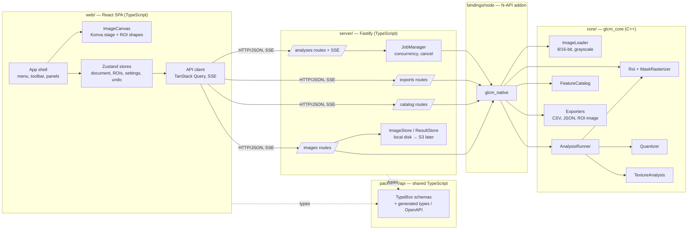
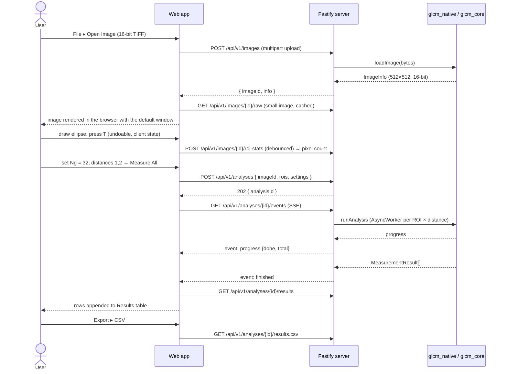

# Texture Analysis Web UI — Design Plan

Status: **Draft v3** — all open questions are resolved, and **phases 0–5 are implemented** (see §9). This is the plan the application was built from; later work went beyond it. The application now also reads DICOM (files and series) and NIfTI volumes, reads and writes ImageJ `.roi` files, filters images (Laplacian of Gaussian, wavelet), opens stacks, converts colour images by channel, HSB component or stain density, and a new `glcm` command line and MCP server exist (`cli/`), so decisions 2–4 and the non-goals below record the choices of the time, not the current scope. The file layout in §4 is the one planned; a few planned files were named differently or merged. The user guide and developer guide in `doc/` describe the application as it is.
Scope: an ImageJ-style texture analysis application with a **TypeScript web frontend** and the existing C++ GLCM core behind a server API. It runs locally on macOS or Linux and can later be deployed to Linux servers for large-scale analysis.

Decisions taken (reviews of drafts v1 and v2):

| # | Question | Decision |
|---|---|---|
| 1 | UI toolkit | **No Qt.** TypeScript frontend in the browser; server-side computation so it can be deployed to servers later. |
| 2 | `glcm-analysis` command-line tool | **Not kept.** Removed together with the legacy OpenCV/cvui UI. |
| 3 | Image formats | 8-bit images and **16-bit TIFF**. No DICOM/NIfTI for now. |
| 4 | ImageJ `.roi` import | Not needed. |
| 5 | Age-based score | **Kept**, age and coefficients configurable. |
| 6 | Correlation III, Sum of Squares (i + j) | **Kept**, marked **non-standard** everywhere they appear. |
| 7 | Gray levels | Default **Ng = 32**, adjustable up to **256**. |
| 8 | Platforms | **macOS and Linux.** |
| 9 | Score calibration settings | **Confirmed:** Ng = 256, d = 1, mean of all four directions, rectangle/polygon ROIs, 8-bit images, age in years (§6.3.2). |
| 10 | Server-mode authentication | **Simple bearer token** (§8.2). |
| 11 | Storage | **Local disk** at first; S3-compatible storage remains a later option (§8.1). |
| 12 | Local mode | **Start the server and open a browser.** No desktop packaging. |

---

## 1. Goals

| # | Requirement | What "done" means |
|---|---|---|
| R1 | Choose and open an image file | Open dialog or drag-and-drop uploads an image (PNG, JPEG, BMP, 8/16-bit TIFF); it is shown with zoom/pan, window/level for 16-bit, and a pixel value readout. |
| R2 | Select ROIs with different shapes | Rectangle, ellipse, polygon and freehand tools; ROIs can be moved, resized, vertex-edited, named, hidden and managed in an ROI Manager with undo/redo. |
| R3 | Calculate texture features with adjustable settings | Settings panel selects features (presets, non-standard ones marked) and parameters (Ng, quantization, distances, directions, aggregation, log base, score); Measure runs on selected or all ROIs with progress and cancel. |
| R4 | Save results; import/export ROIs and ROI images | Results export to CSV/JSON; ROI sets import/export as JSON; ROI pixels export as cropped image + mask (ZIP); projects save and reopen. |

### Non-goals (first release)

- Image editing (filters, stacks, color channels).
- Multi-user accounts and permissions (designed for, implemented in the server phase — §9).
- DICOM/NIfTI and ImageJ `.roi` files.
- Windows.
- Desktop packaging (Tauri, Electron); local mode is the server plus a browser.

---

## 2. Current state (what the design starts from)

| Area | Today | Consequence |
|---|---|---|
| Core | `glcm::TextureAnalysis(Ng)`; `ProcessRectImage(crop, d)` / `ProcessPolygonImage(image, mask, d)`; `Calculate(std::set<Type>)` returns H, V, LD, RD values plus `Avg()`. | Every ROI shape can use the masked path after rasterization. |
| Input | 8-bit single channel only (`CV_8UC1`); a pixel ≥ `Ng` throws. No quantization. | A quantization step is required for Ng = 32 and for 16-bit images. |
| Region statistics | `Mean` / `Std` are computed from the pixels passed in. | After quantization they must be computed from the **original** intensities (§7). |
| Parameters | `d ≥ 1`; always 4 directions, symmetric, natural log. | Direction subset, several distances, log base are new. |
| Extras | MCC is a separate method; the score uses hard-coded coefficients and Mean/Entropy/Contrast. | MCC becomes a `Type`; score becomes a configurable model (§6.3.2). |
| UI and CLI | OpenCV HighGUI + vendored `cvui.h`, `controller/`, `viewer/`, `glcm-analysis`, `canvas-example`. | Removed (decision 2) once the web app can open an image, draw ROIs and measure (end of phase 3). |
| Output | `SaveAsCSV` appends; header only on file creation. | Replaced by complete CSV/JSON exporters with settings metadata. |
| Verified on the dev machine | OpenCV 5.0 reads/writes 16-bit TIFF losslessly (round-trip max difference 0); Node.js v25.8.1, npm 11.11.0, Docker 29.3.0, nlohmann-json 3.12.0 available. | Stack below is buildable locally. |

---

## 3. Technology choice

### 3.1 Overall shape: client–server web application

```
Browser (TypeScript SPA)  ──HTTP/JSON + SSE──▶  API server (TypeScript, Node.js)  ──N-API──▶  glcm_core (C++)
```

- **Frontend:** runs in any modern browser. It draws and edits ROIs and renders the image for display: for images up to 4096 × 4096 px it applies window/level itself to the raw pixel data (§6.1). All pixel work that affects results happens on the server:
  - decoding 8/16-bit images;
  - quantization;
  - rasterizing ROI masks;
  - GLCM computation.

  This keeps a single implementation of every equation. The display mapping is also defined once and tested for identical output in the browser and on the server.
- **Local mode:** one command starts the server on `127.0.0.1`, which serves the built UI. The user opens `http://localhost:8080`.
- **Server mode:** the same server runs in a Linux Docker image, with authentication, storage limits and, later, a job queue with separate worker processes for large data.

### 3.2 Choices and alternatives

| Layer | Recommended | Why | Alternatives considered |
|---|---|---|---|
| Frontend framework | **React + TypeScript + Vite** | Largest ecosystem for canvas editors, tables and forms; fast dev server. | Vue 3, Svelte — viable; smaller ecosystems for the pieces below. |
| Image canvas + ROI editing | **Konva (react-konva)** | Shapes with transform handles (rect, ellipse incl. rotation, polygon/line), hit-testing, layers, zoom/pan on a `Stage`. | Fabric.js; OpenSeadragon + Annotorious for gigapixel images (later, §8.1). |
| UI components | **Mantine** (menus, modals, forms, notifications) + **react-resizable-panels** (dock layout) | Complete desktop-like widget set, TypeScript first. | MUI, Radix + Tailwind. |
| Tables | **TanStack Table** + virtualization | Sorting, column visibility, 10⁵ rows. | AG Grid (heavier, commercial features). |
| State | **Zustand** (UI/document state, undo/redo via command stack) + **TanStack Query** (server data) | Small, explicit, easy to test. | Redux Toolkit. |
| API server | **Node.js (current LTS) + Fastify + TypeBox schemas** | TypeScript end to end; schemas generate OpenAPI and are shared with the frontend; streaming uploads, SSE, static files, auth plugins; easy to add queues (BullMQ) and object storage (S3) for server deployment. | **Drogon** (C++ web framework, Homebrew 1.9.13): no FFI boundary, but auth/queues/storage are more work in C++. Python FastAPI + pybind11: adds a third language. |
| Native binding | **Node-API addon** (`node-addon-api`, built with **cmake-js**) wrapping `glcm_core`; long work in `Napi::AsyncWorker` with `ThreadSafeFunction` progress | ABI-stable across Node versions; runs off the event loop. | WebAssembly core (browser-only compute, no server scaling). |
| Core JSON | **nlohmann/json** (installed, 3.12.0) | Header-only; used for result/ROI serialization in C++ tests. | — |
| Tests | GoogleTest (core), **Vitest** (addon, server, web), **Playwright** (end-to-end) | One runner for all TypeScript packages. | Jest. |
| Packaging | **npm workspaces** monorepo; **Docker** (Linux amd64/arm64) for servers | npm is installed; pnpm is not. | pnpm/Turborepo later if builds get slow. |

Exact package versions are pinned in `package.json` / lockfile at implementation time.

---

## 4. Architecture

### 4.1 Components



**Rules**

- `glcm_core` knows nothing about HTTP or Node. It is plain C++ with OpenCV and Eigen, and GoogleTest tests it directly.
- The addon is a thin translation layer: JavaScript objects ↔ C++ structs, and async workers.
- The browser never receives a server file path, and the server never accepts one. Images are addressed by an opaque `imageId`.
- The feature catalog (names, groups, the non-standard flag, a link to the equation) comes from `FeatureCatalog` in C++. The UI builds its lists from `GET /api/v1/catalog`, so features are not listed twice.

### 4.2 Repository layout

```
core/                       C++ library glcm_core (CMake)
  analysis/                 TextureAnalysis (moved from analysis/)
  roi/                      Roi.hpp, MaskRasterizer.cpp
  imaging/                  ImageLoader.cpp, Quantizer.cpp, DisplayRenderer.cpp (window/level → 8-bit PNG)
  pipeline/                 AnalysisSettings.hpp, AnalysisRunner.cpp, ScoreModel.hpp, FeatureCatalog.cpp
  io/                       ResultsCsv.cpp, ResultsJson.cpp, RoiImageExport.cpp
  tests/                    GoogleTest (existing tests + new)
bindings/node/              N-API addon (cmake-js), index.d.ts
packages/api/               TypeBox schemas, generated types, openapi.json
server/                     Fastify app: routes/, jobs/, storage/, config.ts
web/                        React app: app/, canvas/, panels/, stores/, api/
e2e/                        Playwright tests
doc/                        Sphinx docs (equations, references) + this plan
Dockerfile, package.json (npm workspaces), CMakeLists.txt
```

Removed at the end of phase 3: `controller/`, `viewer/` (including `cvui.h`), `glcm-analysis.cpp`, `canvas-example.cpp`, `samples/` kept as test data.

### 4.3 Core data model (C++, mirrored by TypeBox schemas)

```cpp
namespace glcm {

// ---- Image ----
struct ImageInfo { int width, height; int bit_depth; /* 8 or 16 */ int source_channels; std::string sha256; };
// ImageLoader::Load(bytes) -> { cv::Mat gray (CV_8UC1 or CV_16UC1), ImageInfo }

// ---- ROI geometry (image pixel coordinates, double precision) ----
struct RectangleRoi { double x, y, width, height; };
struct EllipseRoi   { double cx, cy, rx, ry, angle_deg; };              // rx, ry = semi-axes
struct PolygonRoi   { std::vector<std::array<double, 2>> points; bool freehand; };
struct Roi { std::string id, name, color; std::variant<RectangleRoi, EllipseRoi, PolygonRoi> shape; };

cv::Mat RasterizeMask(const Roi&, cv::Size);  // CV_8UC1, 255 inside; pixel centre rule (§6.2)

// ---- Settings ----
enum class QuantizationMethod { FixedRange, RoiMinMax, FixedBinWidth, None };
enum class Aggregation { PerDirectionAndMean, MeanOnly, MeanAndRange };
enum class LogBase { Natural, Two };

struct ScoreModel {                     // decision 5
    double age = 40.0;
    std::array<double, 4> coefficients{1.138, -1.814, 1.416, 1.714}; // age, Mean, Entropy, Contrast
    ScoreProfile profile = ScoreProfile::Calibration;                 // §6.3.2
};

struct AnalysisSettings {
    std::set<Type> features;                                    // from a preset or custom
    int gray_levels = 32;                                       // decision 7: 2..256
    QuantizationMethod quantization = QuantizationMethod::FixedRange;
    double range_min = 0, range_max = 255;                      // default max = 65535 for 16-bit images
    double bin_width = 0;                                       // FixedBinWidth
    std::vector<int> distances{1};                              // each 1..64
    std::set<Direction> directions{Direction::H, Direction::V, Direction::LD, Direction::RD};
    Aggregation aggregation = Aggregation::PerDirectionAndMean;
    LogBase log_base = LogBase::Natural;
    std::optional<ScoreModel> score;                            // enabled by default in the UI preset "Score"
};

// ---- Results ----
struct MeasurementResult {
    std::string image_id, image_sha256, roi_id, roi_name;
    int pixel_count, distance;
    AnalysisSettings settings;                                  // exact settings used
    std::map<Type, Features> values;                            // per direction + Avg()
    std::optional<Features> score;
    std::vector<std::string> warnings;                          // e.g. "no pixel pairs for 90°"
    std::string timestamp, core_version;
};

}
```

---

## 5. User interface

### 5.1 Main window (browser)

```
┌──────────────────────────────────────────────────────────────────────────────────────────────┐
│ ▣ GLCM Texture Analysis   File  Edit  Image  ROI  Analyze  View  Help            ● Local     │
├──────────────────────────────────────────────────────────────────────────────────────────────┤
│ [↖][✋] │ [▭][◯][⬠][✎] │ [－][100%▾][＋][Fit] │ Window: [0 ━━━●━━━━ 4095] │   [▶ Measure ▾]  │
├──────────────────────────────────────────────────────────────┬───────────────────────────────┤
│                                                              │ ROI Manager              [⋯]  │
│                                                              │ 👁 ■ ROI 1  Rectangle  4 096 px│
│                                                              │ 👁 ■ ROI 2  Ellipse    2 210 px│
│                     Image canvas                             │ ◌  ■ ROI 3  Polygon    1 875 px│
│           (zoom / pan, ROI overlays with handles)            │ [Add (T)] [Duplicate] [Delete]│
│                                                              │ [Import…] [Export…]           │
│                                                              ├───────────────────────────────┤
│                                                              │ Analysis Settings             │
│                                                              │ Preset   [Haralick F1–F14 ▾]  │
│                                                              │ Features [14 selected… ]      │
│                                                              │ Gray levels Ng [ 32 ▾] (≤256) │
│                                                              │ Quantization [Fixed range ▾]  │
│                                                              │   min [0]  max [255]          │
│                                                              │ Distances [1] [2] [+]         │
│                                                              │ Directions ☑0° ☑45° ☑90° ☑135°│
│                                                              │ Aggregation [Per dir + mean ▾]│
│                                                              │ ▸ Advanced (log base, score)  │
├──────────────────────────────────────────────────────────────┴───────────────────────────────┤
│ Results (24 rows)                               [Columns ▾] [Copy] [Export ▾] [Clear]        │
│ ROI    │ d │ Dir     │ Mean   │ Contrast │ Entropy │ Correlation III ⚠ │ Score │              │
│ ROI 1  │ 1 │ Mean    │ 82.67  │ 2.081    │ 4.95    │ 0.0013            │ 71.3  │              │
├──────────────────────────────────────────────────────────────────────────────────────────────┤
│ x 214  y 118  value 1 553 │ zoom 150% │ mri16.tif 512×512 16-bit │ ROI 1 4 096 px │ ⟳ 2 jobs │
└──────────────────────────────────────────────────────────────────────────────────────────────┘
```

- Panels are resizable and collapsible (`react-resizable-panels`). Layout and last-used settings are saved in `localStorage`.
- ⚠ marks non-standard features in the feature picker, column headers and exports. Its tooltip says: *"Non-standard: follows Yang et al. (2012) as printed; see Feature Equations."*
- The mode badge shows **Local** or the server name. Menus are in-app; the browser's native file picker is used for opening and importing.

### 5.2 Menus and shortcuts

| Menu | Items |
|---|---|
| File | Open Image… (⌘/Ctrl+O), Open Project…, Save Project (⌘/Ctrl+S), Export Results ▸ CSV / JSON, Close Image |
| Edit | Undo (⌘/Ctrl+Z), Redo (⌘/Ctrl+Shift+Z), Select All ROIs (⌘/Ctrl+A), Delete ROI (⌫), Preferences… (⌘/Ctrl+,) |
| Image | Zoom In (+) / Out (−) / 100 % (1) / Fit (0), Zoom to Selection (Z), Window/Level ▸ Auto / Full range / Custom, Image Info |
| ROI | Rectangle (R), Ellipse (E), Polygon (P), Freehand (F), Add to Manager (T), Duplicate, Rename, Import ROI Set…, Export ROI Set…, Export ROI Images… |
| Analyze | Measure Selected (M), Measure All (⇧M), Presets ▸, Clear Results |
| View | ROI Manager, Analysis Settings, Results, Navigator (N), Show ROI Labels, Reset Layout |
| Preferences (in Edit) | Scroll behaviour ▸ Auto / Always zoom / Always pan |
| Help | Feature Equations (opens Sphinx docs), Keyboard Shortcuts, About |

### 5.3 Main workflow



---

## 6. Feature details per requirement

### 6.1 R1 — Open image

- **Formats:** PNG, JPEG and BMP (8-bit), and TIFF (8- or 16-bit).
  - Decoded on the server with `cv::imread(IMREAD_UNCHANGED)`.
  - Color images are converted to grayscale, and the UI says so.
  - Alpha channels are ignored.
  - Multi-page TIFF: page 1 only, with a warning.
- **Upload limits:** configurable; by default 200 MB and 20 000 × 20 000 px locally, lower in server mode. Rejected uploads return `413` or `422` with a reason.
- **Image data transfer:** the server always keeps the original image. What the browser receives depends on the image size:

  | Image size | Displayed image | Window/level | Hover pixel readout | Navigator thumbnail |
  |---|---|---|---|---|
  | ≤ 4096 × 4096 px ("small") | Rendered **in the browser** from the raw buffer | Computed in the browser; the slider updates instantly with no requests | Read from the raw buffer | Downsampled in the browser |
  | > 4096 × 4096 px ("large") | 8-bit PNG rendered on the server (`display.png`), at most 4096 px on the long side | A new `display.png` request per window (debounced 150 ms, cached; see *Caching*) | Debounced `GET …/pixel?x&y` | Downsampled in the browser from the current `display.png` |
  | Very large (later phase, §8.1) | Tile pyramid | Rendered per tile | `GET …/pixel?x&y` | Lowest pyramid level |

- **Image info:** the upload response and `GET /images/{id}` include:
  - `width`, `height`, `bitDepth`, `sha256`;
  - `transfer: "raw" | "server"` (which row of the table above applies);
  - a default window, `windowMin` / `windowMax` = the 0.5 and 99.5 percentiles over the whole image;
  - a 256-bin histogram for the window/level control.

  So the browser never has to scan the image for these values.

- **Raw buffer format** (`GET /images/{id}/raw`, small images only; returns `409` for large images):
  - **Body:** grayscale samples row by row, starting at the top-left pixel, with no header or padding. Length = width × height × (bitDepth / 8) bytes.
  - **Byte order:** 16-bit samples are **little-endian**.
  - **Headers:** `Content-Type: application/octet-stream`, `X-Image-Width`, `X-Image-Height`, `X-Image-Bit-Depth` (8 or 16), `X-Image-Byte-Order: little-endian`, `ETag`. The client checks that the decoded length matches the headers before using the buffer.
  - **Reading 16-bit samples:** the client uses a `Uint16Array` view directly on the buffer when the machine is little-endian (checked at runtime). Otherwise it copies through `DataView.getUint16(offset, true)`. All supported platforms are little-endian today, but the code does not assume it.
  - **Size:** at most 16 MiB (8-bit) or 32 MiB (16-bit) before compression. The download shows a progress bar, using a streamed `fetch` and `Content-Length`.

- **Compression:**
  - `/raw` and `/pixel` responses use HTTP `Content-Encoding`, chosen from the browser's `Accept-Encoding`: zstd when both the browser and the server's compression plugin support it, otherwise gzip.
  - The compressed `/raw` body is produced once per image and encoding and stored next to the image, not recomputed per request.
  - PNGs are already compressed and are sent as they are.

- **Window/level mapping:** one definition, used by both the browser renderer and the server's `display.png`, so the two always agree:

  `out = clamp(floor(((v − min) × 510 + (max − min)) / (2 × (max − min))), 0, 255)` for integers `min < max`; when `max = min`, `out = 255` for `v ≥ min` and `0` otherwise.

  This is `round((v − min) × 255 / (max − min))` with halves rounded up, written in integer arithmetic. C++, a JavaScript lookup table and a WebGL2 shader using unsigned-integer textures (`usampler2D`) therefore agree exactly; 32-bit float shader math could not guarantee that. Implemented as `glcm::WindowLevel` in `core/imaging/DisplayRenderer`.

  - **Browser renderer:** a WebGL2 fragment shader. The raw data is uploaded once as an `R8UI` / `R16UI` texture (nearest-neighbour sampling), with `min`/`max` as uniforms. The output canvas is the source of the Konva image layer and is redrawn when the slider moves, at most once per animation frame.
  - **Fallback:** used when WebGL2 is unavailable or `MAX_TEXTURE_SIZE` is smaller than the image. A lookup table (256 or 65 536 entries) is applied to `ImageData` on a canvas; slower, but still local. If that fails too (e.g. out of memory), the image is handled as large.
  - **8-bit images** use the same path, so window/level works for them as well.

- **Caching:**
  - **`/raw`:** `ETag` = image SHA-256, with `Cache-Control: private, max-age=31536000, immutable`, because the content behind an image id never changes.
  - **`display.png`:** `ETag` = a hash of the image SHA-256, `min`, `max`, `maxSize` and the renderer version; `Cache-Control: private, max-age=86400`; `If-None-Match` gets `304`.
    - The server keeps rendered PNGs in a size-capped LRU cache under `GLCM_DATA_DIR/cache/`.
    - The browser keeps the last 20 as blob URLs in memory, revoking them when evicted.
  - **`/pixel`:** `Cache-Control: no-store` (tiny responses, many positions).
  - **Why `private`:** it keeps shared proxies from storing token-protected responses in server mode.
- **Canvas:** Konva `Stage`. Image smoothing is off above 100 %, so pixels stay sharp. The zoom range is 5 %–3200 %, and zooming keeps the point under the cursor (or between the fingers) fixed. Navigation:

  | Input | Action |
  |---|---|
  | Hover | Status bar shows `x`, `y` and pixel value under the cursor (see *Image data transfer*). |
  | Mouse wheel | Zoom in/out around the cursor. |
  | Trackpad pinch (macOS) | Zoom around the fingers. Browsers report pinch as a `wheel` event with `ctrlKey = true`; Safari also sends `gesturechange`, which is handled too. |
  | Trackpad two-finger scroll | Pan. |
  | Space + drag, or Pan tool (✋) + drag, or middle-button drag | Pan. |
  | Arrow keys (no ROI selected) | Pan by 50 screen px; **Shift** + arrow pans by one viewport. |
  | Arrow keys (ROI selected) | Move the selected ROIs by 1 image px; **Shift** + arrow by 10 px (undoable). |
  | **+** / **−** | Zoom in/out around the viewport centre. |
  | **1** / **0** | Zoom to 100 % / fit the image to the window. |
  | **Z** | Zoom to the selected ROIs: fit their combined bounding box with 10 % padding, capped at 3200 %. |

  - **Wheel vs. trackpad:** a mouse wheel and a trackpad two-finger scroll both arrive as `wheel` events.
    - *Scroll behaviour: Auto* (default): events with `ctrlKey` zoom. Other events zoom when they look like a mouse wheel (vertical only, line mode or large whole-number steps), and pan otherwise.
    - *Preferences* lets users override this with *Always zoom* or *Always pan*. Holding **⌘/Ctrl** while scrolling always zooms.
  - **Navigator:** a small overview map in the bottom-right corner of the canvas.
    - It shows a thumbnail of the whole image (at most 256 px on the long side, rendered with the current window/level) and a rectangle marking the visible area.
    - Drag the rectangle to pan; click anywhere on the thumbnail to centre the view there.
    - It appears automatically when the image does not fit in the window at the current zoom, and can be toggled with **N** or *View ▸ Navigator*.
    - With the tile pyramid for large images (§8.1), it uses the lowest pyramid level.
- **Entry points:** File ▸ Open, drag-and-drop, and "Open sample image" on the empty start screen (uses `samples/textures/camera.png`).

### 6.2 R2 — ROI selection and ROI Manager

| Tool | Create | Edit |
|---|---|---|
| Rectangle (R) | drag; Shift = square | Konva `Transformer` handles, drag to move |
| Ellipse (E) | drag bounding box; Shift = circle | handles + rotation handle |
| Polygon (P) | click vertices; double-click or click first vertex to close; Esc cancels | drag vertices; double-click edge adds a vertex; Alt-click removes one |
| Freehand (F) | press-drag-release | move; stored as polygon simplified with Douglas–Peucker (0.5 px) |

- **Active vs managed:** the shape being drawn is the *active* ROI. **T** / *Add* moves it into the ROI Manager with the name "ROI n" and a distinct color.
- **ROI Manager:**
  - each row shows visibility, color, name (double-click to rename), shape and pixel count;
  - multi-select (⌘/Ctrl, Shift); selection syncs with the canvas;
  - actions: duplicate, delete, show/hide all.
- **Undo/redo:** a command stack in Zustand covers add, delete, rename, move, resize, rotate and vertex edits. Limited to 200 steps.
- **Coordinates:** always image pixels (double precision), independent of zoom.
- **Hovering over an ROI:**
  - its outline is highlighted;
  - after 300 ms, a tooltip next to the cursor shows its name, shape and pixel count;
  - the ROI's row in the ROI Manager is highlighted as well.

  *View ▸ Show ROI Labels* instead shows every ROI's name permanently next to its shape. Labels keep a constant screen size at any zoom.
- **Zoom to ROI:** the ROI Manager's row menu (⋯) has *Zoom to ROI*, with the same behaviour as **Z** on the canvas.
- **Mask rule:** a pixel belongs to the ROI if its **centre** lies inside the shape. Rasterization happens only in `glcm_core`:
  - rectangles: half-open test of the centre;
  - ellipses: exact test after rotating the centre into the ellipse's own axes;
  - polygons: scanline even-odd fill along the pixel-centre rows.

  This is `glcm::RasterizeMask` in `core/roi/Roi`. `cv::fillPoly` is not used, because its edge handling does not follow the pixel-centre rule.

  The pixel count shown in the manager comes from the server, so the numbers match the analysis exactly.
- **Validation:** ROIs are clipped to the image. The manager flags an ROI (⚠, with a tooltip) and Measure skips it with a warning when it has fewer than 2 pixels, or has no pixel pairs for a selected direction at a selected distance.

### 6.3 R3 — Analysis settings and measurement

#### 6.3.1 Settings

| Setting | Control | Values (default **bold**) | Core work |
|---|---|---|---|
| Preset | select | **Haralick F1–F14**; Clausi 2002 (Contrast, Correlation, Entropy); Basic (Mean, Std, Contrast, Entropy, Energy, Homogeneity II, Correlation II); Score (Mean, Entropy, Contrast + score); All; Custom | presets from `FeatureCatalog` |
| Features | grouped checklist dialog (groups as in `doc/equations.rst`), search box; ⚠ badge on **Correlation III** and **Sum of Squares (i + j)** | from preset | existing `Calculate` |
| Gray levels `Ng` | select + number input | 8, 16, **32**, 64, 128, 256 (any integer 2–256) | existing |
| Quantization | select + fields | **Fixed range** (min/max, default image type range: 0–255 or 0–65535); ROI min–max; Fixed bin width; None (only allowed when all ROI values < Ng) | **new** `Quantizer` |
| Distances | number chips | **1**; each 1–64 | loop in runner |
| Directions | checkboxes | **0°, 45°, 90°, 135°** | **new** subset |
| Aggregation | select | **Per direction + mean**; Mean only; Mean + range (Haralick 1973) | **new** in runner |
| Log base (Advanced) | select | **Natural**; log₂ (for comparison with PyRadiomics/mahotas) | **new** |
| Maximal Correlation Coefficient | feature checkbox; warning when Ng > 64 (cost grows as Ng³ per direction) | off | expose as `Type` |
| Score (Advanced) | switch + age input + 4 coefficient inputs + profile select | on in "Score" preset; age **40**, coefficients **1.138, −1.814, 1.416, 1.714** | configurable `ScoreModel` |

**Region statistics:** `Mean` and `Std` are computed from the ROI's **original** intensities, not the quantized ones. Texture features use the quantized image.

#### 6.3.2 Age-based score

The score keeps today's formula:

`Score = c₀·age + c₁·Mean + c₂·Entropy + c₃·Contrast`, computed per direction and averaged.

The coefficients were fitted with the current application's settings (confirmed: Ng = 256, d = 1, mean of all four directions, rectangle/polygon ROIs on 8-bit images, age in years), so the score is only meaningful when Mean, Entropy and Contrast are computed the same way. With the new default of Ng = 32, Entropy and Contrast change scale. Planned behaviour:

- **Calibration profile (default):** the score's inputs are computed with the original settings (Ng = 256, fixed range 0–255, d = 1, all four directions, mean of directions), no matter what the user selected for the table. The Score column shows the profile in its tooltip.
- **Current settings profile (opt-in):** uses the user's settings. A warning says the coefficients may not apply.
- **16-bit images:** the calibration profile maps intensities linearly from the window range to 0–255 first, and warns that the score was calibrated on 8-bit images.

#### 6.3.3 Running a measurement

- **Measure Selected (M) / Measure All (⇧M):** sends `POST /api/v1/analyses` with the image id, ROI geometries and settings. The server validates the request against the schema.
- **Jobs:** each ROI × distance pair is one job, run in `Napi::AsyncWorker`s.
  - Concurrency is limited to the number of CPU cores, configurable.
  - `TextureAnalysis` keeps state, so each job creates its own instance.
- **Progress:** sent to the browser as Server-Sent Events. The status bar shows running jobs; **Cancel** calls `DELETE /api/v1/analyses/{id}`, and jobs that haven't started are dropped.
- **Results table:** results are appended as rows. Each row keeps the settings it was computed with (tooltip, and a "Settings" column that is hidden by default).
  - Changing settings never alters existing rows.
  - Sorting, column chooser, copy as TSV.
- **Failures:** a failed job becomes a row marked failed, with the core's error message (for example "Pixel value 300 is out of the gray level range (Ng = 256)"). Other jobs continue.

### 6.4 R4 — Save, import and export

| Action | Where | Format | Contents |
|---|---|---|---|
| Export results | server (`GET /analyses/{id}/results.csv` / `.json`, or `POST /exports/results` for the current table) | **CSV** | One row per ROI × distance × direction (plus Mean/Range rows). Columns: timestamp, image name, image SHA-256, ROI name/id, pixel count, Ng, quantization, d, direction, then features; non-standard feature headers end with ` [non-standard]`. Settings repeated as `# key=value` lines at the top. Complete file, never appended. |
| | | **JSON** | `{ format: "glcm-results", version: 1, results: MeasurementResult[] }` |
| Export ROI set | client | JSON `*.roi.json` | §8.4 schema; includes image name, size and SHA-256 to detect mismatches. |
| Import ROI set | client | JSON above | Validated with the shared schema; adds ROIs (undoable); warns if image size or hash differ; clips out-of-bounds ROIs. |
| Export ROI images | server (`POST /api/v1/exports/roi-images`) | **ZIP** of PNG (8-bit) or TIFF (16-bit) | Per ROI: bounding-box crop with outside pixels = 0 (PNG option: transparent), `<name>_mask.png`, optionally the quantized crop (`<name>_q<Ng>.png`); `manifest.json` with ROI geometry and settings. |
| Save project | client download (local mode) / server storage (server mode) | JSON `*.glcmproj` | Image reference (name, SHA-256; image bytes embedded optionally for portability), ROI set, settings, results. |
| Open project | client | JSON above | Re-uploads the image if the server does not have its hash. |

---

## 7. Changes required in the C++ core

Each change comes with GoogleTest coverage. Existing tests stay green.

1. **Move and library target:** move `analysis/` to `core/analysis/` and build `glcm_core` as a static library with `-fPIC`, so the addon can link it.
2. **Masked processing for all shapes:** add `ProcessMaskedImage(image, mask, d)` (used by all ROI shapes). The existing test that a full mask equals the rectangle path keeps covering it.
3. **16-bit input:** `ImageLoader` returns `CV_8UC1` or `CV_16UC1`. The quantizer maps either to `CV_8UC1` in `[0, Ng)` before `TextureAnalysis`.
4. **Quantizer:** fixed range, ROI min–max (computed over mask pixels only), fixed bin width. Tests cover a constant ROI, values outside the range (clipped), and `Ng` = 2 and 256.
5. **Region statistics on original intensities:** `Mean`/`Std` come from the unquantized image and the mask, not from `TextureAnalysis`'s input.
6. **Directions and log base:** compute only the selected directions (unselected ones are NaN and omitted from results); log base as a setting.
7. **MCC as a `Type`**, marked "slow" in the catalog.
8. **`ScoreModel` and score profiles** (§6.3.2), replacing the hard-coded coefficients.
9. **`FeatureCatalog`:** id, display name, group, `non_standard` flag and reason, equation anchor in the Sphinx docs, and cost class.
10. **Exporters:** results CSV/JSON and ROI image export. Remove `SaveAsCSV` and `Print` once nothing uses them.
11. **Cancellation hook:** `RunAnalysis` checks a cancel flag between jobs.

---

## 8. Cross-cutting concerns

### 8.1 Performance and large data

- **Uploads:** streamed to disk, never held in memory as base64.
- **Cost:**
  - building the GLCM is O(pixels × directions × distances);
  - most features are O(Ng²);
  - MCC is O(Ng³) per direction.

  The default Ng of 32 keeps MCC practical.
- **Images above ~8 000 px:** a later phase serves a tile pyramid (Deep Zoom) instead of a single display PNG, and swaps the canvas base layer for OpenSeadragon, keeping the ROI overlay in image coordinates.
- **Transfer sizes:** browser memory stays bounded.
  - Small images send their raw data once: at most 16 MiB (8-bit) or 32 MiB (16-bit) before compression (§6.1).
  - Large images send only display PNGs of at most 4096 px on the long side, plus individual pixel values.
- **Server scaling:** a later phase moves `JobManager` behind a queue (BullMQ + Redis). Separate worker processes load the same addon, and `ImageStore`/`ResultStore` get an S3-compatible implementation. The HTTP API stays the same.

### 8.2 Security (server mode)

- **Binding:** local mode binds to `127.0.0.1` only and needs no token.
- **Token authentication (server mode):**
  - Server mode is any bind address other than loopback. There, the server refuses to start unless `GLCM_API_TOKEN` is set, to at least 32 random bytes.
  - Every `/api/v1` request except `/health` must send `Authorization: Bearer <token>`. The server compares it in constant time and returns `401` without details.
  - The web app asks for the token once and keeps it in `sessionStorage`, so closing the tab clears it.
  - Images are fetched as blobs with the header rather than plain `` URLs, and progress events use a `fetch`-based SSE client rather than `EventSource`, because neither `` nor `EventSource` can send an `Authorization` header.
  - Tokens are rotated by restarting with a new value. Per-user accounts are out of scope.
- **Transport:** HTTPS terminated at a reverse proxy (e.g. Caddy or nginx), a CORS allow-list (empty by default, since the UI is served from the same origin), and per-token rate limits.
- **Paths:** no client-supplied file paths. Uploaded files get random ids, and export file names are sanitized.
- **Input validation:** image dimensions, `Ng` ≤ 256, distances ≤ 64, ≤ 10 000 vertices per ROI, ≤ 1 000 ROIs per request. Every request body is schema-validated.
- **Retention:** uploaded images and results expire after a configurable time.
- **Storage:** local disk under `GLCM_DATA_DIR`, with subfolders `images/`, `results/`, `exports/`.
  - The default is `~/.glcm-texture-analysis` in local mode and `/data` (a Docker volume) in server mode.
  - Files are named by random ids; nothing outside the data directory is read or written.
  - `ImageStore` and `ResultStore` stay behind interfaces, so S3-compatible storage can be added later without API changes.

### 8.3 Testing

| Level | Tool | What |
|---|---|---|
| Core | GoogleTest | Existing reference tests; rasterizer pixel counts (rectangle, ellipse, rotated ellipse, concave polygon, clipping); quantizer; score profiles; exporters. |
| Addon | Vitest | JS ↔ C++ conversion; async worker results equal core results; cancellation; error mapping. |
| Server | Vitest + `fastify.inject` | Every route: schema validation, limits, SSE progress, CSV/JSON content. `/raw`: byte length and size headers match the image, 16-bit samples are little-endian, `409` for large images, `Content-Encoding` negotiation, precompressed body reused. `display.png`: output follows the window/level formula, `ETag` / `304`, cache eviction. |
| Web | Vitest + Testing Library | Stores (undo/redo, ROI edits), settings validation, table formatting; viewport maths (zoom keeps the point under the cursor fixed, zoom limits, fit, zoom to selection); wheel classification (mouse wheel, pinch with `ctrlKey`, two-finger scroll) with recorded event samples; arrow-key rules with and without a selection; screen ↔ image coordinate conversion used by the hover readout and navigator; window/level output of the WebGL2 renderer and the lookup-table fallback is pixel-identical to the server's `display.png` for the same `min`/`max` (including `max = min`); raw buffer decoding on both the little-endian view path and the `DataView` copy path. |
| End-to-end | Playwright (Chromium, WebKit) | Open sample image → draw each ROI type → Measure → values match core test values → export CSV → import ROI set round trip. Navigation: the hover readout shows the known pixel value at a known position after zooming and panning; zoom with wheel, `ctrlKey` wheel (pinch) and keys; pan with Space-drag and arrows; **Z** frames the selected ROI; dragging the navigator rectangle moves the view; the ROI hover tooltip shows the name. |

CI (GitHub Actions) runs on `macos-latest` (arm64) and `ubuntu-latest` (x86_64), and builds the Docker image.

### 8.4 File formats

Every file has a `format` and an integer `version`; readers reject versions they don't know. Example ROI set:

```json
{
  "format": "glcm-roi-set",
  "version": 1,
  "image": { "name": "mri16.tif", "width": 512, "height": 512, "bitDepth": 16, "sha256": "…" },
  "rois": [
    { "id": "7f3c…", "name": "ROI 1", "color": "#FFD400",
      "shape": { "type": "rectangle", "x": 100, "y": 100, "width": 64, "height": 64 } },
    { "id": "a91e…", "name": "ROI 2", "color": "#00C2FF",
      "shape": { "type": "ellipse", "cx": 260.5, "cy": 300, "rx": 40, "ry": 25, "angle": 30 } },
    { "id": "c02d…", "name": "ROI 3", "color": "#FF4FD8",
      "shape": { "type": "polygon", "points": [[10, 10], [80, 20], [40, 90]], "freehand": false } }
  ]
}
```

Example analysis request (`POST /api/v1/analyses`):

```json
{
  "imageId": "img_01J…",
  "rois": [ { "id": "7f3c…", "name": "ROI 1", "shape": { "type": "rectangle", "x": 100, "y": 100, "width": 64, "height": 64 } } ],
  "settings": {
    "features": ["Contrast", "Entropy", "CorrelationII", "CorrelationIII"],
    "grayLevels": 32,
    "quantization": { "method": "fixedRange", "min": 0, "max": 65535 },
    "distances": [1, 2],
    "directions": [0, 45, 90, 135],
    "aggregation": "perDirectionAndMean",
    "logBase": "natural",
    "score": { "enabled": true, "age": 40, "coefficients": [1.138, -1.814, 1.416, 1.714], "profile": "calibration" }
  }
}
```

### 8.5 API summary (`/api/v1`)

| Method & path | Purpose |
|---|---|
| `GET /health` | Liveness, core version |
| `GET /catalog` | Features (id, name, group, nonStandard, docAnchor, cost), presets, limits |
| `POST /images` | Upload (multipart) → `{ imageId, info }` |
| `GET /images/{id}` · `DELETE /images/{id}` | Metadata · remove |
| `GET /images/{id}/display.png?min&max&maxSize` | 8-bit PNG with window/level, long side ≤ `maxSize` (default 4096); `ETag` / `304` |
| `GET /images/{id}/raw` · `GET /images/{id}/pixel?x&y` | Raw grayscale buffer for images ≤ 4096² (little-endian, size headers, compressed, immutable cache; `409` otherwise) · single value |
| `POST /images/{id}/roi-stats` | Pixel count, bounding box, min/max/mean for ROIs |
| `POST /analyses` · `GET /analyses/{id}` · `DELETE /analyses/{id}` | Start (202) · status · cancel |
| `GET /analyses/{id}/events` | SSE: `result` (each finished job, including failed ones; earlier results are replayed on connect), `progress`, `finished` (status `completed`, `cancelled` or `failed`) |
| `GET /analyses/{id}/results[.csv|.json]` | Results |
| `POST /exports/results` | CSV/JSON for an arbitrary list of result rows (the current table) |
| `POST /exports/roi-images` | ZIP of ROI crops, masks, manifest |

The OpenAPI document is generated from the TypeBox schemas (as built: written to `packages/api/openapi.json` by `npm run openapi`; the server does not publish it).

### 8.6 Build and platforms

- **Toolchains:** CMake for `core/` and the addon (cmake-js); npm workspaces for `packages/api`, `server`, `web` and `e2e`.
- **Commands:**
  - `npm run dev` runs the Vite dev server and the Fastify server, with a watch build of the addon.
  - `npm run build && npm start` runs local mode.
- **Architecture:** remove the hard-coded `CMAKE_OSX_ARCHITECTURES "arm64"`, since Linux and Docker builds need their own architectures.
- **Docker:** a multi-stage build (compile core and addon, build the web app, slim Node runtime with the OpenCV runtime libraries), for `linux/amd64` and `linux/arm64`.
- **Platforms:** macOS (Apple Silicon) and Linux, per decision 8.

---

## 9. Implementation phases

| Phase | Scope | Exit criteria |
|---|---|---|
| **0. Core preparation** — implemented | §7 items 1–11, repository layout, CMake changes | All existing and new GoogleTest tests pass on macOS and Linux. **Met:** 80 tests, 0 warnings on macOS (Apple Clang, OpenCV 5) and on Ubuntu 24.04 arm64 and x86_64 (GCC 13, OpenCV 4.6). |
| **1. Addon + API skeleton** — implemented | N-API addon, Fastify server, `packages/api` schemas, `/health`, `/catalog`, `/images` (upload, display, raw, pixel) | Vitest server/addon tests pass; OpenAPI generated. **Met:** the addon builds without warnings, and 37 Vitest tests and `tsc` pass on macOS (Node 25) and Linux arm64 (`node:24-bookworm`, GCC 12, OpenCV 4.6); `packages/api/openapi.json` generated. Until phase 5 the server refuses non-loopback addresses; the image SHA-256 is computed by the server while streaming the upload. |
| **2. Web shell + image viewer** — implemented | Vite/React app, layout, menus, open image, zoom/pan, window/level, pixel readout | **R1 met** in local mode. **Met:**<br>• **Opening:** `npm start` serves the built app; images open by file dialog, drag-and-drop or `GET /samples`.<br>• **Rendering:** raw transfer with the WebGL2 integer shader (LUT fallback); in Chrome it matched the formula pixel for pixel for 8- and 16-bit windows.<br>• **Large images:** served as `display.png`, with `/pixel` hover values.<br>• **Navigation and display:** zoom/pan/navigator/keyboard/wheel classification, window/level with histogram.<br>• **Checks:** 98 Vitest tests (38 web unit tests) and `tsc` pass, and the web app builds, on macOS (Node 25) and Linux arm64 (`node:24-bookworm`). Component tests are deferred to the Playwright suite of phase 3. |
| **3. ROI tools + measurement** — implemented | ROI tools and manager, undo/redo, roi-stats, settings panel, presets, analyses + SSE, results table; **remove `controller/`, `viewer/`, `cvui.h`, `glcm-analysis`, `canvas-example`** | **R2, R3 met**; Playwright test values equal core test values. **Met:**<br>• **ROI tools:** rectangle, ellipse, polygon and freehand. The drawn shape stays active until **T** adds it. The ROI Manager has visibility, rename, duplicate, delete, zoom to ROI and multi-select. Transformer handles and polygon vertex edits work, with undo/redo of 200 steps. Pixel counts come from `POST /roi-stats`.<br>• **Measurement:** the settings panel covers presets, the feature picker with ⚠ non-standard badges, Ng, quantization, distances, directions, aggregation, log base and score; it is kept in localStorage. `POST /analyses` queues one addon job per ROI × distance with limited concurrency. Progress arrives over SSE and can be cancelled.<br>• **Results table:** rows per aggregation keep their settings; sorting, column chooser and TSV copy.<br>• **Legacy app:** removed, together with `TextureAnalysis::Print`/`SaveAsCSV`.<br>• **Checks:** 3 Playwright tests pass in Chromium and WebKit. They draw every ROI type and measure; measured values equal the addon's for the same geometry and settings, and pixel counts equal `roiStats`. They also cover the hover readout after key and wheel zoom, arrows, Space-drag, **Z**, navigator drag, ROI tooltip and undo. Core tests (80), Vitest (150) and `tsc` pass on macOS and Linux arm64 (`node:24-bookworm`). |
| **4. Save / import / export** — implemented | Results CSV/JSON, ROI set import/export, ROI image ZIP, projects | **R4 met**; import/export round trips are lossless. **Met:**<br>• **Results:** `glcm::ResultsFromJson` reads `glcm-results` documents back, so the server writes the CSV and JSON of the table with the core. That is `POST /exports/results`: documents with equal settings and image are merged, otherwise a ZIP with one file per group; `GET /analyses/{id}/results.csv\|.json` serves one analysis.<br>• **ROI images:** `POST /exports/roi-images` returns a ZIP from `glcm::ExportRoiImages`.<br>• **ROI sets:** `*.roi.json` import is validated with the shared TypeBox schema, warns about a different image, clips shapes to the image, and is undoable.<br>• **Projects:** `*.glcmproj` holds the image reference with an optional embedded image, ROIs, settings and finished results. Open Project finds the image with `GET /images?sha256=`, re-uploads the embedded file (served by `GET /images/{id}/original` when saving), or asks for the image file.<br>• **Checks:**<br>&nbsp;&nbsp;– Core JSON → JSON and CSV round trips are byte-identical (GoogleTest).<br>&nbsp;&nbsp;– 4 Playwright tests pass in Chromium and WebKit: exported CSV/JSON values equal the addon's doubles; ROI set export → delete → import restores ids, names, colors and shapes; project save → reopen restores ROIs, settings and result rows, with an embedded image after deleting it from the server and via SHA-256 lookup without it; ROI images ZIP contents and pixel counts.<br>&nbsp;&nbsp;– Core tests (82), Vitest (170) and `tsc` pass, and the web app builds, on macOS and Linux arm64 (`node:24-bookworm`). |
| **5. Server deployment** — implemented | Docker image with a data volume, config, bearer-token authentication, limits, retention, CI | Image runs on Linux; security checklist (§8.2) passes. **Met:**<br>• **Modes:** a non-loopback `GLCM_HOST` is server mode. It refuses to start without a `GLCM_API_TOKEN` of at least 43 characters, and defaults to `/data`, 100 MiB uploads, 600 requests/min per token and 168 h retention.<br>• **Protection:** bearer authentication on `/api/v1` except `/health` (SHA-256 digests compared with `timingSafeEqual`, 401 without details), a CORS allow-list and rate limits.<br>• **Storage:** finished analyses persist in `results/`, and retention deletes expired images and results.<br>• **Web app:** asks for the token once per tab (`sessionStorage`) and sends it with every request, including display images, raw pixels, uploads and the fetch-based SSE.<br>• **Deployment:** multi-stage `Dockerfile` (runtime `node:24-bookworm-slim` with the OpenCV runtime libraries, user `node`, `/data` volume, health check) and `compose.yaml`; `doc/deployment.md` has the reverse proxy setup and the security checklist mapped to tests.<br>• **Checks:**<br>&nbsp;&nbsp;– The image runs on Linux arm64 (Docker Desktop): it exits with status 1 without a token or with a short token, becomes healthy, runs as `node`, stops gracefully on SIGTERM, and passes `scripts/smoke-test.mjs` (authentication, upload, analysis, SSE, CSV export).<br>&nbsp;&nbsp;– 187 Vitest tests, including the server security tests for configuration, authentication, CORS, rate limits, input limits, persisted results and retention.<br>&nbsp;&nbsp;– 16 Playwright tests in Chromium and WebKit, including the access-token flow against a server with a token.<br>&nbsp;&nbsp;– `.github/workflows/ci.yml` runs all of this on `ubuntu-latest` and `macos-latest` and builds and smoke-tests the image; it has not run on GitHub yet. |
| **6. Large data (later)** | Job queue + workers, S3 storage, tile pyramid viewer, batch over many images | Defined when phase 5 is done. Batch measurement of many images from the browser (*Analyze ▸ Batch Measure…*) and stacks exist since. |

---

## 10. Risks

| Risk | Mitigation |
|---|---|
| Native addon build friction (OpenCV/Eigen linking, Node versions) | Node-API is ABI-stable; build in CI for both platforms; Docker image for servers. |
| Mask differences between the canvas drawing and the server mask | Masks only computed in the core; pixel counts shown from the server; mask export for inspection; rasterizer tests with known counts. |
| Score coefficients invalid under new settings | Calibration profile by default (§6.3.2), warning otherwise, profile recorded with every result. |
| Quantization strongly changes results (Clausi 2002; Brynolfsson 2017) | Ng and quantization shown in the table and every export. |
| Large 16-bit uploads over slow links | Streaming uploads, size limits, later tiles; local mode avoids the network. |
| WebGL2 unavailable, or its texture size limit is below the image size | `MAX_TEXTURE_SIZE` checked at load; lookup-table canvas fallback; otherwise the large-image path with server-rendered PNGs. |
| Browser and server window/level output drift apart | One mapping formula (§6.1) and a pixel-identical comparison test (§8.3). |
| Mouse wheel and trackpad scrolling can't be told apart reliably in the browser | "Auto" heuristic with recorded-event tests; `ctrlKey`/pinch always zooms; a *Scroll behaviour* preference to force zoom or pan. |
| Scope creep toward a full ImageJ clone | Non-goals; phase exit criteria. |

---

## 11. Open questions

None. All questions from drafts v1 and v2 are resolved (see the decisions table at the top); phases 0–5 have been applied.
