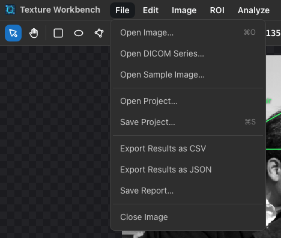
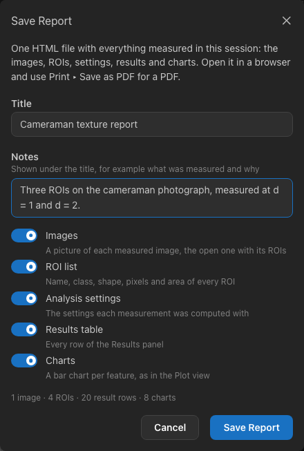
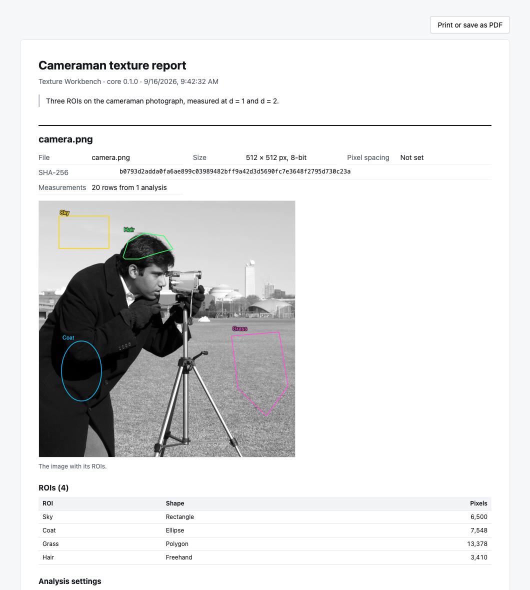

.. _files:

Saving, importing and exporting
===============================

         Results as JSON, Save Report and Close Image.
   :align: center

   The File menu.

.. list-table::
   :header-rows: 1
   :widths: 30 25 45

   * - To keep
     - Use
     - File
   * - The results table
     - *File ▸ Export Results as CSV / JSON*
     - ``<image>-results.csv`` or ``.json``
   * - The ROIs, to use them again
     - *ROI ▸ Export ROI Set…*
     - ``<image>.roi.json``
   * - The ROIs, to open them in ImageJ or Fiji
     - *ROI ▸ Export ROIs for ImageJ…*
     - ``<image>-RoiSet.zip``
   * - The pixels inside the ROIs
     - *ROI ▸ Export ROI Images…*
     - ``<image>-rois.zip``
   * - Everything: ROIs, settings and results
     - *File ▸ Save Project…*
     - ``<image>.glcmproj``
   * - A report to read, share or print
     - *File ▸ Save Report…*
     - ``<image>-report-<date>.html``

Files are saved by your browser, usually into the Downloads folder.

.. _export-results:

Exporting results
-----------------

*File ▸ Export Results as CSV* (or **Export ▸ CSV** above the Results table) saves all rows of the table:

- The file starts with lines beginning with ``#`` that record the core version, the time of the measurement, the image
  and its SHA-256 checksum, the pixel spacing and value conversion when there are any, a filter or resampling when one
  was used, and all other settings (gray levels, quantization, distances, directions, aggregation, log base and score).
- Then follows a header row and one row per ROI, distance and direction (or mean and range), with the timestamp, image,
  image checksum, ROI name and id, status, pixel count, gray levels, quantization, distance, direction, one column per
  feature, the score and the warnings.
- For a stack, a ``slice`` column follows the ROI id (and the class).
- When a measured ROI has a class (see :ref:`roi-classes`), a ``roiClass`` column follows the ROI id; it is empty for
  ROIs without a class. JSON results carry the class as ``roiClass``.
- With a pixel spacing, a ``# pixelSpacingMm=`` line gives it (width;height), and an ``areaMm2`` column follows the
  pixel count: the pixel count × pixel width × pixel height.
- Columns of non-standard features end with ``[non-standard]``.
- Numbers are written with full precision.
- Text cells (image and ROI names, ids and warnings) that start with ``=``, ``+``, ``-`` or ``@`` get a leading
  apostrophe, so that spreadsheet programs show them as text instead of running them as formulas. The same applies
  when you copy rows from the Results table.

Most spreadsheet programs open the file directly; if they show the ``#`` lines as data, skip the lines before the
header row when importing.

*Export Results as JSON* saves the same results as a structured ``glcm-results`` document, convenient for scripts.

If the table contains results measured with **different settings** (or on different images), each group is saved as its
own file, and the files are delivered together as a ZIP archive.

.. tip::

   To paste results into a spreadsheet quickly, use **Copy** above the Results table instead; it copies the visible
   columns as tab-separated text.

.. _roi-sets:

ROI sets
--------

*ROI ▸ Export ROI Set…* saves the ROIs of the ROI Manager — names, colours, classes and exact shapes — together with the
name, size and checksum of the image and the list of classes. *ROI ▸ Import ROI Set…* adds the ROIs of such a file to
the open image:

- If the ROIs were drawn on a different image (other size, bit depth or file), a warning says so; the ROIs are imported
  anyway.
- ROIs that extend beyond the image are cut at its border (an ellipse that overlaps the image is kept whole; only its
  pixels on the image are measured); ROIs completely outside it are skipped, and the notification
  lists them.
- Classes of the file that the class list does not have yet are added to it; the ROIs keep their classes.
- ROIs of a stack keep their slices (see :ref:`stacks`). ROIs without a slice are put on the slice shown; ROIs on
  slices the image does not have are skipped, and the notification lists them. On an image without slices, ROIs of
  slice 1 are imported as they are.
- The import is one step that :kbd:`⌘Z` / :kbd:`Ctrl+Z` undoes.

This way the same regions can be measured on several images of the same size, or again later with other settings.

.. _imagej-rois:

ROIs from and for ImageJ
~~~~~~~~~~~~~~~~~~~~~~~~

*ROI ▸ Import ROI Set…* also opens the ROI files of `ImageJ <https://imagej.net>`_ and Fiji: a single ``.roi`` file,
or a ``RoiSet.zip`` saved by ImageJ's ROI Manager (*More ▸ Save…*). ROIs drawn there can be measured here without
drawing them again, and each ROI covers **exactly the pixels ImageJ measures** for it, so an ImageJ area or mean and the
pixel count and mean here agree:

- Rectangles, ovals, polygons, freehand and traced (wand) outlines, spline-fitted outlines, rotated rectangles and
  ellipses, rectangles with rounded corners and composite ROIs (with holes or several parts) are imported. Rectangles
  and ovals stay rectangles and ellipses; the others become polygons.
- ImageJ's names, outline colours and positions in a stack are kept: an ROI on slice 12 in ImageJ lies on slice 12
  here. Lines, points, angles and text have no area to measure and are left out;
  the notification lists them.
- ImageJ counts a pixel whose centre lies exactly on an edge differently from this application. Imported polygons are
  moved by a hundred-millionth of a pixel so that such pixels are counted as in ImageJ; the shift disappears when the
  ROIs are written back for ImageJ.

*ROI ▸ Export ROIs for ImageJ…* (also in the ROI Manager's menu) saves the ROIs as a ``RoiSet.zip`` that ImageJ's ROI
Manager opens, covering **the same pixels in ImageJ as here**. Rectangles, ellipses and polygons stay rectangles, ovals
and polygons when ImageJ fills the same pixels for them. An ROI that would cover different pixels in ImageJ — an
ellipse that is rotated or not on whole pixels, a polygon with an edge exactly through pixel centres (livewire outlines
often have them) — and an ROI with holes or several parts is saved as the outline of its pixels instead: a traced ROI,
or a composite ROI. The notification lists those ROIs. The slice of an ROI in a stack is saved as its position in
ImageJ. Classes are not saved, since ImageJ's ROI files have no place for them.

Exporting ROI images
--------------------

*ROI ▸ Export ROI Images…* saves the pixels of the ROIs as image files in a ZIP archive:

.. figure:: images/export-roi-images.png
   :alt: The Export ROI Images dialog with a choice between selected and all ROIs and options for transparency and
         quantized gray levels.
   :align: center

   Exporting ROI images.

- Choose **Selected ROIs** or **All ROIs**.
- For each ROI, the archive contains the crop of its bounding box with the pixels outside the ROI set to 0
  (``<name>.png``, or a 16-bit TIFF ``<name>.tif`` for 16-bit images), and its mask ``<name>_mask.png`` (white inside).
- **Transparent outside the ROI** (8-bit images) makes the outside pixels transparent instead of black.
- **Include quantized gray levels** adds ``<name>_q<Ng>.png`` with the gray levels computed with the current analysis
  settings.
- File names come from the ROI names (characters other than letters, digits, ``-``, ``_`` and ``.`` become ``_``).
  When two ROIs would share a file name, for example ROIs named ``a`` and ``a_mask``, ``_2``, ``_3``, ... is appended,
  so no file overwrites another.
- ``manifest.json`` lists every ROI with its shape, bounding box, pixel count and files, or why it was skipped.
- For a stack, the files of each slice are in a folder ``slice-<n>`` with its own ``manifest.json``.

.. _reports:

Reports
-------

A report is one HTML file that tells the whole story of a session: the images with their ROIs, what was measured, with
which settings, and the results as tables and charts. It is meant to be read, sent to a colleague, attached to a study,
or printed.

         and charts.
   :align: center

   Saving a report.

*File ▸ Save Report…* opens the dialog:

- **Title** and **Notes** appear at the top of the report. Use the notes to say what was measured and why; they are the
  only part that is not taken from the data.
- The **switches** choose what the report contains: the images, the ROI list, the analysis settings, the results table
  and the charts. Your choice is remembered for the next report.
- The line above the buttons counts what would be saved, for example *2 images · 7 ROIs · 84 result rows · 16 charts*.

The report contains every image in the Results panel, in the order in which they were measured — a batch run over ten
images gives one report with ten sections. For each image it shows:

- its file name, size, pixel spacing, value conversion (for DICOM and NIfTI files and converted colour images) and
  SHA-256 checksum;
- a picture of the image. The image currently open is drawn as you see it, with the display window, colour table and its
  ROIs; images measured earlier are drawn with their own default window, without ROIs, as long as the server still has
  them;
- the ROI list with class, shape, pixel count and area;
- the analysis settings of every measurement, with the time it was made;
- the results table, exactly as in the Results panel;
- charts as in the Plot view: a bar chart per feature (for at most 12 features), a polar chart of the directions of the
  first feature when the directions were kept, and a chart against the distance when several distances were measured.

   The beginning of a report, opened in a browser.

The file is **self-contained**: the pictures are embedded in it and the charts are drawn as vectors inside the file, so
it needs no other files and no internet connection. Nothing is loaded from the network when it is opened, which also
means it can be archived or attached to an email as it is.

**For a PDF**, open the report in a browser and use *Print ▸ Save as PDF* (the button at the top right of the report
does the same). The report has a print layout: each image starts on a new page, tables and figures are not split across
pages, and the page is printed on white.

A report is a record, not a project: it cannot be opened again for editing. Save a project as well when you want to
continue working (see below).

Projects
--------

A project keeps a complete session: the image reference, the pixel spacing in use, the ROIs (including hidden ones) with
their classes and the class list, the analysis settings and all finished results.

.. figure:: images/save-project.png
   :alt: The Save Project dialog with the option Embed the image.
   :align: center

   Saving a project.

- *File ▸ Save Project…* (:kbd:`⌘S` / :kbd:`Ctrl+S`) saves ``<image>.glcmproj``. The project refers to the image by
  name and checksum. Choose **Embed the image** to include the image file itself, so that the project can be opened on
  another computer or server, or after the image was deleted there. Embedding makes the file about a third larger than
  the image.
- *File ▸ Open Project…* opens a project. If the server still has the image, it is used; otherwise an embedded image is
  uploaded again; otherwise the application asks you to choose the image file. The ROIs, settings and results table of
  the project, and its class list, replace the current ones.

Project and ROI set files can also be dragged onto the window. Files ending in ``.glcmproj`` are opened as projects;
other ``.json`` files, and ImageJ's ``.roi`` and ``.zip`` files, are imported as ROI sets.

.. note::

   On a shared server, images and results are deleted after some time (7 days by default). Save a project with the
   image embedded, or export the results, to keep your work.
