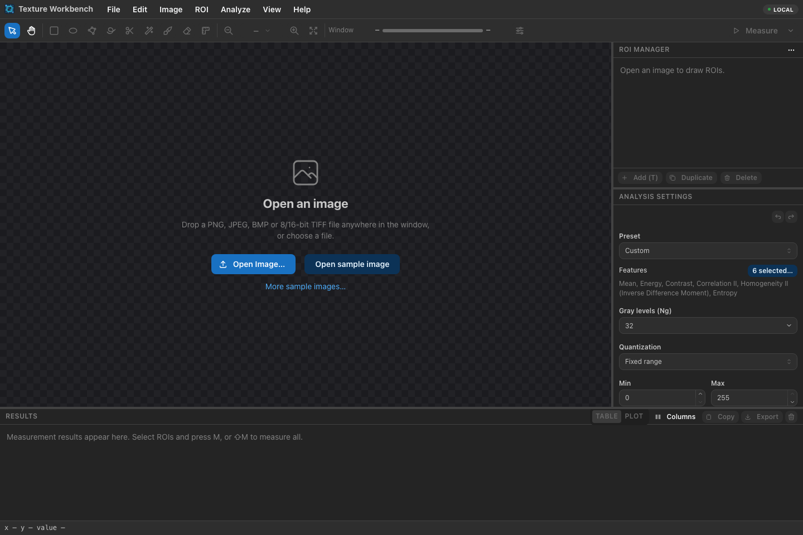
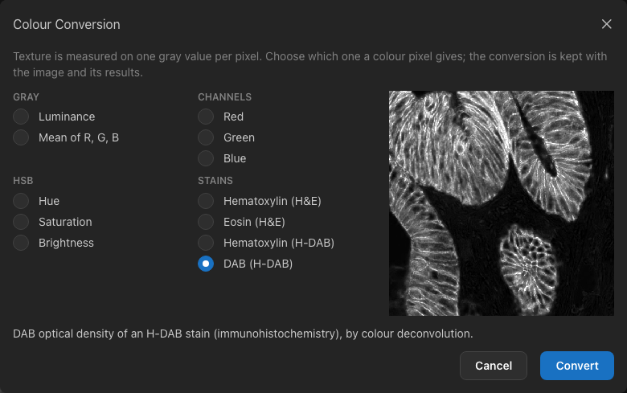
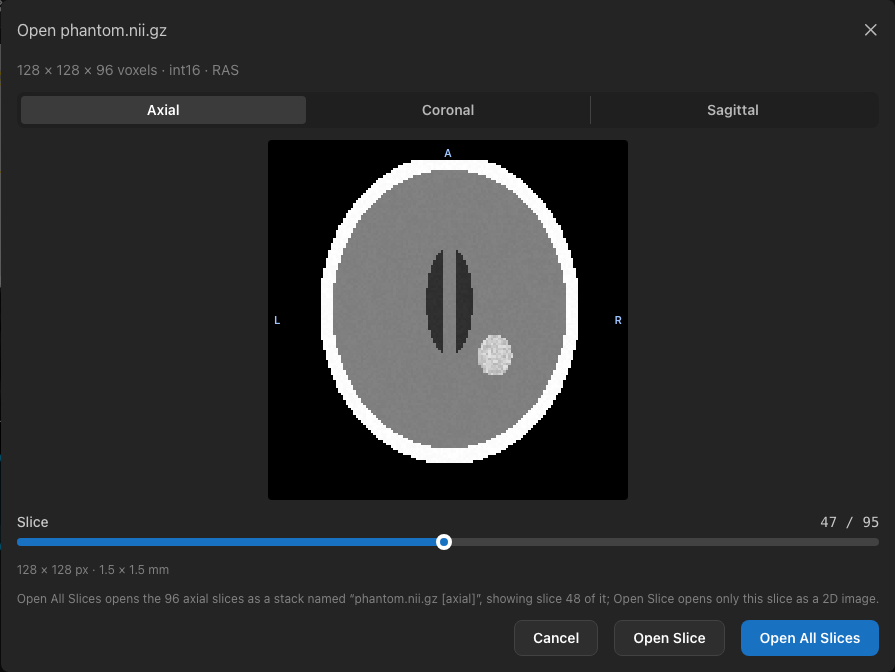
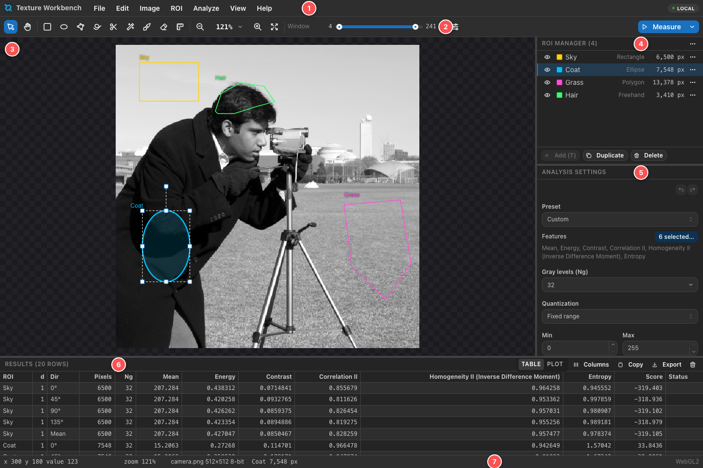

.. _getting-started:

Getting started
===============

Starting the application
------------------------

**On your own computer**, build and start the server once the requirements in ``INSTALL.md`` are installed:

.. code-block:: bash

   npm install
   npm run build:native
   npm run build:web
   npm start

Then open http://127.0.0.1:8080 in your browser. The server only accepts connections from this computer, and your
images and results are stored in ``~/.glcm-texture-analysis``. Stop the server with :kbd:`Ctrl+C` in the terminal.
The same build also gives you the ``glcm`` command and an MCP server for AI assistants, described in :ref:`scripting`.

**On a shared server**, open the address your administrator gives you. The first time, the application asks for an
**access token**:

.. figure:: images/token-prompt.png
   :alt: The Access token dialog with a password field and a Continue button.
   :align: center

   Servers shared by several people require an access token.

Paste the token and choose **Continue**. The token is kept only for this browser tab; after closing the tab, you are
asked again. To enter a different token, choose *File ▸ Change Access Token…*. On a shared server, uploaded images and
results are usually deleted automatically after some days (7 by default), so export or save what you want to keep
(see :ref:`files`).

Opening an image
----------------

   The start screen.

There are three ways to open an image:

- **Open Image…** on the start screen or in the *File* menu (:kbd:`⌘O` / :kbd:`Ctrl+O`) shows the file dialog.
- **Drag** an image file from your desktop or file manager onto the window.
- **Open sample image** opens ``textures/camera.png``, the cameraman photograph; **More sample images…** (or *File ▸ Open Sample Image…*) lists synthetic
  test patterns, natural textures and medical images (chest and abdominal CT slices, a brain MRI slice, a chest X-ray and a mammogram, all 16-bit).

Supported files are PNG, JPEG, BMP and TIFF with 8 or 16 bits per pixel, uncompressed DICOM images and NIfTI files
(see :ref:`medical-files`). The image is uploaded to the server, which decodes it:

- **Colour images** are converted to their luminance, and a notification says so. *Image ▸ Colour Conversion…* measures
  a channel, an HSB component or a stain instead (see :ref:`colour-images`).
- **Multi-page TIFF files** open as a **stack**, one slice per page (see :ref:`stacks`). Pages after the first page of
  another size or type are left out, and a notification says so.
- **16-bit images** keep their full intensity range for measurements; the display uses a window (see
  :ref:`window-level`).
- **Limits:** by default an image can have up to 200 MB and 20 000 × 20 000 pixels on your own computer (100 MB and
  10 000 × 10 000 pixels on a shared server), and a stack up to 1 000 000 000 pixels in all its slices together
  (400 000 000 on a shared server). Larger files are rejected with a message.

Opening another image replaces the current one, together with its ROIs; the results table keeps its rows. *File ▸
Close Image* closes the image. *Image ▸ Image Info* shows the file name, size, bit depth, channels (and how a colour image was
converted), the value conversion of DICOM, NIfTI and converted colour images, default display window and SHA-256 checksum of the open image.

.. _colour-images:

Colour images
~~~~~~~~~~~~~

Texture is measured on one value per pixel, so a colour image opens as its **luminance**, 0.299 R + 0.587 G + 0.114 B.
That mixes the colours of a stained tissue section: a brown DAB stain and a blue hematoxylin stain can end up with the
same gray value. *Image ▸ Colour Conversion…* (enabled for colour images) chooses another conversion:

   Converting the ``textures/ihc.png`` sample to its DAB density.

- **Gray**: *Luminance* (as the image opened) or *Mean of R, G, B*, the unweighted mean.
- **Channels**: *Red*, *Green* or *Blue*, unchanged.
- **HSB**: *Hue*, *Saturation* or *Brightness*, as ImageJ's *Image ▸ Type ▸ HSB Stack* computes them.
- **Stains**: the optical density of one stain, separated by **colour deconvolution** [Ruifrok2001]_ with the stain
  vectors scikit-image uses: *Hematoxylin* or *Eosin* of an **H&E** stain, or *Hematoxylin* or *DAB* of an **H-DAB**
  stain (immunohistochemistry). Where there is more of the stain, the value is higher.

The preview shows the first slice converted, with its own display window. **Convert** opens the converted image in
place of the current one: the ROIs, the zoom and the slice shown stay, so the same regions can be measured on several
conversions. The converted image is stored as its own image, named like ``ihc.png [DAB H-DAB]`` (``[red]``,
``[hue]``, …); converting the same way again opens it again, and *Luminance* returns to the image as it was uploaded.
Channels, the mean and HSB components keep the bit depth of the file; stain densities are stored as 16-bit values.

The conversion is recorded as the image's value conversion, which *Image Info* shows and exported results carry
(``valueConversion``), for example *Red channel; value = stored value*. Stain densities keep their scale, for example
*DAB optical density (H-DAB colour deconvolution, scikit-image hdx_from_rgb); OD = stored value × 2.33943e-05*: texture
features are computed on the stored values, while the value conversion gives the density they stand for. The formulas
are in :ref:`colour-conversion`.

Only the images that were uploaded as colour files can be converted (for a DICOM series, which is stored as gray
slices, the colours are gone). A project refers to the converted image by its checksum; when the server no longer has
it, the project's embedded copy opens as a plain gray image without the conversion.

.. _medical-files:

DICOM and NIfTI files
~~~~~~~~~~~~~~~~~~~~~

**DICOM** files (``.dcm``, or any name) open like other images when they are uncompressed (implicit or explicit VR
little endian). Compressed DICOM files (JPEG, JPEG-LS, JPEG 2000 or RLE) are refused with a message; convert them first,
for example with ``dcmdjpeg`` or ``gdcmconv --raw``. A file with several frames opens as a stack, one slice per frame,
with the values of all frames stored alike; when the file holds fewer frames than it declares, the frames it has open
and a notification says so. (Enhanced DICOM files keep their pixel spacing and rescale per frame in
sequences, which are not read; a notification says so.)

A **DICOM series** — a folder of single-frame files, one per slice, as a CT or MR scanner writes them — opens as one
stack with *File ▸ Open DICOM Series…*, which asks for the folder. Files that are not DICOM images are left out; when
the folder holds several series, the one with the most files is used; the slices are ordered along the patient axis
across the image plane (ImagePositionPatient), or by instance number when the files have no position. The values of
all files are stored with one conversion, the pixel spacing comes from the first file and the window from the first
file that has one, and the stack is named after the folder. A series can have up to 10 000 files (2 000 on a shared
server), together no larger than the volume limit below.

**NIfTI** files (``.nii`` or ``.nii.gz``, NIfTI-1 or NIfTI-2) hold volumes. When a 3D or 4D file opens, a dialog asks
how to open it:

   Opening a NIfTI volume.

- **Orientation**: *Axial*, *Coronal* or *Sagittal*. Slices are shown in RAS orientation, whatever the order of the
  axes in the file: axial slices with the patient's right on the right and anterior at the top; coronal slices with
  superior at the top; sagittal slices with anterior on the right. The letters on the edges of the preview give the
  directions. The dialog starts in the plane of the file's first two axes, at the middle slice.
- **Slice** (0 is the most inferior, posterior or left slice) and, for 4D files, **Volume** (for example a time point).
  The arrow keys move the focused slider one step.
- **Open All Slices** opens every slice in the chosen orientation as a stack named like ``brain.nii.gz [axial]`` (with
  ``, volume 3`` for 4D files), showing the slice chosen in the dialog. In the stack, slices count from 1, so slice 120
  of the dialog is slice 121 there.
- **Open Slice** opens only the chosen slice as a normal 2D image named like ``brain.nii.gz [axial 120]``. Open the file
  again to choose another slice.

Either way the pixel spacing is the in-plane voxel size.

A NIfTI file with a single slice opens directly.

**Values.** Measurements use 8- or 16-bit samples, so the values of DICOM and NIfTI files are converted, and the
conversion is shown in *Image Info* and written into exported results (``valueConversion``):

- The rescale is applied first: RescaleSlope and RescaleIntercept (DICOM), or ``scl_slope`` and ``scl_inter`` (NIfTI).
- Integer values between 0 and 65 535 are stored unchanged.
- Integer values with a negative minimum of at least −1024 are stored + 1024, as long as the maximum + 1024 still fits
  in 65 535. For CT this is HU + 1024, as in the CT samples: air (−1000 HU) is stored as 24 and water as 1024. In CT
  files (DICOM files with Hounsfield units), lower values mark pixels outside the scan field: they are stored as 0,
  and a notification says so.
- Other values (for example floating-point data) are mapped linearly from their minimum–maximum to 0–65 535; for
  NIfTI files the minimum and maximum of the whole file, so all slices are stored alike.
- DICOM **MONOCHROME1** images, where low values are bright, are inverted so that bright means dense.

For example, *Rescale slope 1, intercept -1024; values stored + 1024; HU = stored value - 1024*. Texture features
are computed from the stored samples.

**Metadata.** DICOM PixelSpacing (or ImagerPixelSpacing, the spacing at the detector) gives the pixel spacing, and
the first WindowCenter/WindowWidth the initial display window. NIfTI slices open with the window of the whole file
(its 0.5th and 99.5th percentiles). By default a volume can have up to 4 GB of voxel data (1 GB on a shared server).

.. _main-window:

The main window
---------------

   Areas of the main window.

#. **Menu bar** — *File*, *Edit*, *Image*, *ROI*, *Analyze*, *View* and *Help*. The badge at the right shows
   **Local** on your own computer, or the server name.
#. **Toolbar** — pointer and pan tools, the ROI tools (rectangle, ellipse, polygon, freehand, livewire, magic wand, brush
   and eraser), the ruler, zoom, the display window, and **Measure**.
#. **Image canvas** — the image with its ROIs. A navigator appears in the corner when the image is larger than the
   view.
#. **ROI Manager** — the ROIs of the image with their pixel counts.
#. **Analysis Settings** — the features and GLCM parameters used by the next measurement.
#. **Results** — one or more rows for every measured ROI.
#. **Status bar** — the position and value of the pixel under the pointer, the zoom, the image, the selected ROI and
   its pixel count, the progress of running measurements, and how the image is rendered.

The panels can be resized by dragging the borders between them; the side panel (ROI Manager and settings) and the
Results panel can be collapsed by dragging their border all the way. The layout is remembered; *View ▸ Reset Layout*
restores it.
