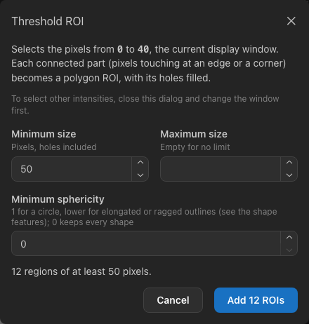
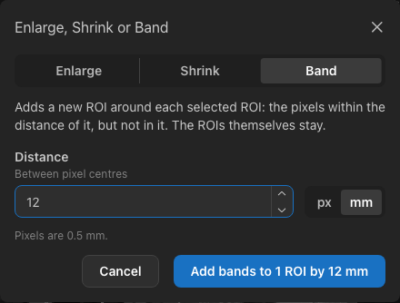
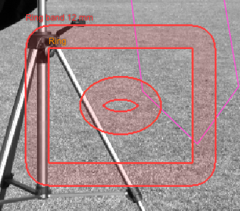

.. _rois:

Regions of interest
===================

A region of interest (ROI) is the part of the image that is measured. ROIs are drawn on the canvas, kept in the ROI
Manager, and measured together or one by one.

.. figure:: images/canvas-rois.png
   :alt: The sample image with a rectangle ROI (Sky), a selected ellipse ROI (Coat) with resize handles, a polygon ROI
         (Grass) and a freehand ROI (Hair), each labeled with its name.
   :width: 100%

   Four ROIs with labels. The selected ROI ("Coat") shows handles for resizing and rotating.

Drawing ROIs
------------

Choose a tool in the toolbar, in the *ROI* menu or with its key, then draw on the image:

.. list-table::
   :header-rows: 1
   :widths: 20 12 68

   * - Tool
     - Key
     - How to draw
   * - Rectangle
     - :kbd:`R`
     - Drag from one corner to the opposite corner. Hold :kbd:`Shift` for a square.
   * - Ellipse
     - :kbd:`E`
     - Drag the bounding box of the ellipse. Hold :kbd:`Shift` for a circle.
   * - Polygon
     - :kbd:`P`
     - Click each vertex. Close the polygon by double-clicking, pressing :kbd:`Enter`, or clicking the first vertex
       again. :kbd:`Backspace` removes the last vertex; :kbd:`Esc` cancels.
   * - Freehand
     - :kbd:`F`
     - Press, trace the outline and release. The outline is simplified slightly and kept as a polygon.
   * - Livewire
     - :kbd:`I`
     - Click points around an object: the outline between them follows the strongest edges. Close it by double-clicking,
       pressing :kbd:`Enter`, or clicking the first point again; see :ref:`livewire`.
   * - Magic wand
     - :kbd:`W`
     - Click a region. The pixels connected to the clicked pixel whose values are within the tolerance become the ROI;
       see :ref:`rois-by-intensity`.
   * - Brush
     - :kbd:`B`
     - Press and drag to paint into the selected ROI, or into a new ROI when none is selected; see :ref:`editing-rois`.
   * - Eraser
     - :kbd:`X`
     - Press and drag to remove a stroke from the selected ROI.

A newly drawn shape has a **dashed white outline**: it is the *active* ROI and not yet part of the ROI Manager. Press
:kbd:`T` (or **Add (T)** in the ROI Manager, or *ROI ▸ Add to Manager*) to add it. It then gets a name ("ROI 1",
"ROI 2", …) and its own color. Drawing another shape replaces an active ROI that was not added.

If you measure while an active ROI exists and no ROI is selected, the active ROI is added automatically and measured.

.. tip::

   ROIs are placed in image pixel coordinates, independent of the zoom. Zoom in to draw small ROIs precisely.

.. _livewire:

Outlining along edges (livewire)
--------------------------------

The **livewire** tool (:kbd:`I`, also called intelligent scissors) draws an outline that snaps to the edges of an object:

#. Click a point on the object's boundary.
#. Move the pointer along the boundary: a preview shows the path the outline would take to the pixel under the pointer,
   following the strongest edges nearby. Click to fix the path up to that point.
#. Continue around the object. :kbd:`Backspace` removes the last point, and :kbd:`Esc` cancels the outline.
#. Close the outline by double-clicking, pressing :kbd:`Enter`, or clicking the first point again (at least three points
   are needed). The closed outline becomes the active ROI; press :kbd:`T` to add it.

Between two points the path is the cheapest chain of neighbouring pixels, where pixels on strong edges are cheap. It
stays within 32 pixels of the rectangle spanned by the two points, and the points may be at most 1,024 pixels apart. The
gradient uses the **Smoothing σ** of the edge map (see :doc:`viewing`), so showing the edge map helps to see which edges
the livewire will follow. Where the boundary is faint, add points closer together.

.. _rois-by-intensity:

Selecting ROIs by intensity
---------------------------

Two tools create ROIs from pixel values instead of a drawn outline. Both treat pixels that touch at an edge or at a
corner as connected, and outline each region along the pixel edges, so the ROI contains exactly the selected pixels.
Holes inside a region are filled: they belong to the ROI, and so does anything lying in them.

- **Magic wand** (:kbd:`W`, or *ROI ▸ Magic Wand*): click a pixel. The pixels connected to it whose values differ from
  the clicked pixel's value by at most the **tolerance** become the active ROI; press :kbd:`T` to add it. The tolerance
  is the **±** field that appears next to the tool buttons while the wand is chosen. It starts at 5 % of the image's
  default display window whenever an image opens.
- **Threshold ROI** (*ROI ▸ Threshold ROI…*): selects every pixel whose value lies inside the current display window
  (see :doc:`viewing`), so set the window first. Each connected part becomes an ROI when it has at least the **Minimum
  size** (50 pixels by default, holes included), at most the **Maximum size** (empty: no limit) and at least the
  **Minimum sphericity** — the shape feature of the same name, measured in pixels: 1 for a circle, lower for elongated
  or ragged parts, so 0.7 keeps roughly round cells and drops streaks and noise. The dialog shows how many regions that
  gives; **Add** puts them into the ROI Manager, largest first, with the usual names and colours, and selects them. At
  most 1,000 are added at once; narrow the filters to add fewer. One undo step removes them all.

         the number of regions and the Add button.
   :width: 60%

   Threshold ROI counts the regions inside the display window before adding them.

An ROI may have at most 10,000 vertices. A longer outline, for example around a large noisy region, is simplified to
fit, and a message says so; its edges then no longer follow the pixels exactly.

.. _roi-classes:

ROI classes
-----------

A **class** groups ROIs that belong together, such as *lesion* and *normal* regions, so that the groups can be compared.
Each ROI has at most one class.

- *ROI ▸ ROI Classes…* (or **Manage Classes…** in the ROI Manager's menus) lists the classes. **Add class** adds one;
  change its name in the field and pick its colour from the swatches. The number on the left is its shortcut. Deleting
  a class removes it from its ROIs, which keep their colour.
- To give ROIs a class, select them and press :kbd:`⇧` with the class number (:kbd:`⇧1` for the first class, up to
  :kbd:`⇧9`), or choose the class in an ROI's **⋯** menu in the ROI Manager. :kbd:`⇧0` (or **No class**) removes it.
  ROIs take the colour of their class, and the ROI Manager shows the class after the ROI's name. Assigning a class can be
  undone.
- Renaming or recolouring a class changes its ROIs too. The class list is kept when you open another image.

Measurements record each ROI's class. The Results table then shows a **Class** column and can show one class at a time,
the plots can combine the ROIs of each class (see :doc:`measuring`), and exported results, ROI sets and projects include
the classes (see :doc:`files`).

.. _editing-rois:

Painting and combining ROIs
---------------------------

The brush, the eraser and the commands of this section change ROIs pixel by pixel, with the same rule that decides which
pixels an ROI contains (see below). The result is again one polygon ROI whose outline follows the pixel edges.

- **Brush** (:kbd:`B`): with one ROI selected, press and drag over the image to add the stroke to that ROI. With no ROI
  selected, the stroke becomes a new ROI in the ROI Manager, which is then selected, so further strokes add to it. The
  stroke covers the pixels whose centres lie within half the **brush size** of the path; set the size (a diameter in
  image pixels, 10 by default) in the **⌀** field next to the tool buttons.
- **Eraser** (:kbd:`X`): removes a stroke of the same size from the selected ROI. Erasing across an ROI can split it
  into parts, and erasing inside it leaves a hole. An ROI erased completely is deleted.
- **Union** (*ROI ▸ Union*, or in the ROI Manager's **⋯** menu): merges the selected ROIs into one. It keeps the name and
  colour of the ROI you selected first; the others are removed.
- **Subtract** (*ROI ▸ Subtract*, or the ROI Manager's menu): removes the pixels of the other selected ROIs from the ROI
  you selected first. The other ROIs stay.
- **Intersect** (*ROI ▸ Intersect*, or the ROI Manager's menu): keeps the pixels that all selected ROIs have in common,
  for example the part of a lesion that lies inside an organ. Like *Union*, the result takes the place of the ROI you
  selected first, and the others are removed. When the ROIs share no pixel, nothing changes.
- **XOR** (*ROI ▸ XOR*, or the ROI Manager's menu): keeps the pixels that only one of two selected ROIs covers (with more
  ROIs, the pixels an odd number of them cover), merged like *Union*.

.. figure:: images/roi-editing.png
   :alt: A selected rectangle ROI with an elliptical hole, made by subtracting an ellipse; the tinted fill leaves the hole clear.
   :width: 45%

   A rectangle with an ellipse subtracted: one ROI with a hole.

Enlarging, shrinking and bands
~~~~~~~~~~~~~~~~~~~~~~~~~~~~~~

*ROI ▸ Enlarge or Shrink…* and *ROI ▸ Make Band…* (also in the ROI Manager's menu) open one dialog for the selected ROIs:

   A 12 mm band around the selected ROI.

- **Enlarge** adds every pixel within the distance of the ROI.
- **Shrink** keeps the pixels of the ROI that are farther than the distance from every pixel outside it. The edge of the
  image counts as outside, so an ROI that touches the edge shrinks away from it too. An ROI that would lose all its
  pixels is left unchanged, and a notification says so.
- **Band** adds a new ROI around each selected ROI, named after it (*Lesion band 5 mm*): the pixels Enlarge would add.
  The ROI itself stays, so the region and its surroundings — for example a tumour and the tissue around it — can be
  measured side by side. A band around an ROI with a hole also fills in the edge of the hole.

         corners and also lines the inside of the hole.
   :width: 45%

   A band of 12 mm around a rectangle with a hole.

Distances are measured **between pixel centres**, and a pixel counts when it is not farther than the distance: enlarging
by 1 pixel adds the four pixels next to each edge pixel, but not the diagonal ones, which are √2 away. The distance is
in pixels, or in millimetres when the image has a pixel spacing (see :ref:`pixel-spacing`). Millimetres are exact also
for pixels that are not square: 2 mm on 0.5 × 1 mm pixels reaches four columns but only two rows. Corners become rounded,
since the pixels at a corner are farther away diagonally.

.. note::

   ImageJ's *Enlarge* and *Make Band* differ in details. Both round the distance to whole pixels, converting millimetres
   with the pixel width only. *Enlarge* keeps rectangles and ovals as larger or smaller rectangles and ovals instead of
   rounding their corners, and when shrinking other shapes also removes the pixels whose distance lies between the given
   distance and one pixel more.

Each stroke and each command is one undo step. The canvas shows the stroke while it is drawn, and the ROI changes a
moment later.

An ROI with several parts or holes is still a single polygon: its outline runs around each part and each hole, and
zero-width cuts join them into one. The cuts cover no pixels and are not drawn, so pixel counts and measurements include
exactly the painted pixels. Such an ROI has no vertex handles; change it with the brush and the eraser, or move it as a
whole.

Which pixels belong to an ROI
-----------------------------

A pixel belongs to an ROI when the **center of the pixel** lies inside the shape. The pixel count shown for each ROI is
computed this way by the same code that measures, so it always matches the measurement. Parts of an ROI outside the
image are ignored.

An ROI with fewer than 2 pixels cannot be measured; the ROI Manager marks it with ⚠. Measurements also warn when an ROI
has no pixel pairs in a direction at the chosen distance — for example, a one-pixel-high rectangle has no vertical
pairs.

Selecting and editing ROIs
--------------------------

Choose the **Pointer** tool (the arrow in the toolbar) to work with existing ROIs:

- **Select** an ROI by clicking inside or on its outline. Hold :kbd:`Shift`, :kbd:`⌘` or :kbd:`Ctrl` to add or remove
  ROIs from the selection. Click an empty area to clear the selection. *Edit ▸ Select All ROIs* (:kbd:`⌘A` /
  :kbd:`Ctrl+A`) selects all.
- **Move** the selected ROIs by dragging one of them, or with the arrow keys (1 pixel; :kbd:`Shift` for 10 pixels).
- **Resize** a selected rectangle or ellipse with its handles; **rotate** an ellipse with the handle above it.
- **Edit a polygon:** select it to show its vertices. Drag a vertex to move it, double-click an edge to add a vertex,
  or :kbd:`Alt`-click a vertex to remove it (a polygon keeps at least 3 vertices).
- **Delete** the selected ROIs with :kbd:`Delete` or :kbd:`Backspace`.

Hovering over an ROI highlights it and, after a moment, shows a tooltip with its name, shape and pixel count. *View ▸
Show ROI Labels* shows every ROI's name next to it.

**Undo and redo:** *Edit ▸ Undo* (:kbd:`⌘Z` / :kbd:`Ctrl+Z`) and *Edit ▸ Redo* (:kbd:`⌘⇧Z` / :kbd:`Ctrl+Shift+Z`)
cover adding, deleting, renaming, moving, resizing, rotating, vertex edits and imports — up to 200 steps. Opening
another image clears the history.

The ROI Manager
---------------

.. figure:: images/roi-manager.png
   :alt: The ROI Manager listing Sky, Coat, Grass and Hair with their shapes and pixel counts; Coat is selected.
   :align: center

   The ROI Manager.

Each row shows, from left to right:

- **visibility** (the eye) — hidden ROIs are not drawn, but they can still be selected here and measured;
- **color** and **name** — double-click the name to rename it, then press :kbd:`Enter`; choose another color in the
  row menu;
- **shape** — Rectangle, Ellipse, Polygon or Freehand, after the slice number for ROIs on a slice of a stack (see
  :ref:`stacks`); clicking an ROI of another slice shows its slice;
- **pixel count**, or ⚠ with an explanation when the ROI cannot be measured;
- a **menu** (⋯) with *Zoom to ROI*, *Rename*, a choice of eight **colors**, *Duplicate*, *Copy to All Slices* (stacks)
  and *Delete*. Changing the color
  can be undone like other ROI changes.

Click a row to select the ROI; :kbd:`⌘`/:kbd:`Ctrl`-click to add it to the selection; :kbd:`Shift`-click to select a
range. The selection and the highlighted ROI are the same on the canvas and in the manager.

The buttons below the list add the active ROI, duplicate the selected ROIs (the copies are moved by 10 pixels) and
delete the selected ROIs. The menu at the top right shows or hides all ROIs, and imports and exports ROI sets (see
:ref:`roi-sets`), also from and for ImageJ (see :ref:`imagej-rois`).
