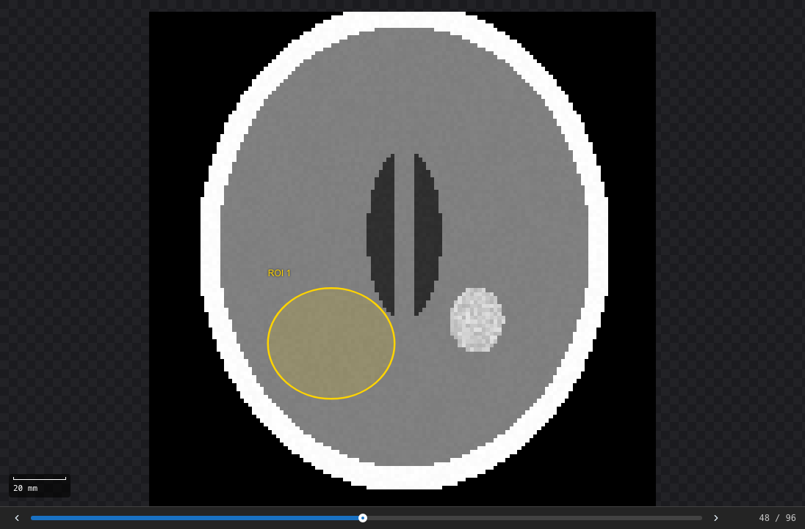
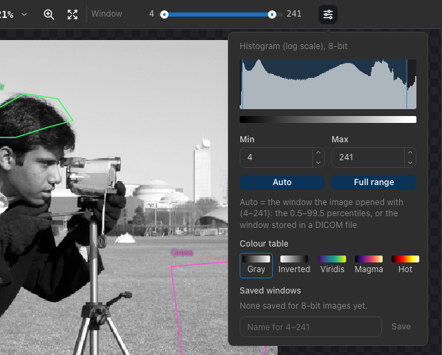

.. _viewing:

Viewing images
==============

Zooming and panning
-------------------

When an image opens, it is fitted into the canvas. The zoom ranges from 5 % to 3200 %; above 100 % pixels are drawn as
sharp squares, so individual pixels can be inspected.

.. list-table::
   :header-rows: 1
   :widths: 35 65

   * - To
     - Do this
   * - Zoom around the pointer
     - Scroll the mouse wheel, or pinch on a trackpad
   * - Zoom in or out around the center
     - :kbd:`+` / :kbd:`−`, the zoom buttons in the toolbar, or *Image ▸ Zoom In / Zoom Out*
   * - Show 100 % or fit the image
     - :kbd:`1` / :kbd:`0`, the zoom menu in the toolbar, or *Image ▸ Zoom 100 % / Fit to Window*
   * - Pan
     - Scroll with two fingers on a trackpad; drag while holding :kbd:`Space`; drag with the middle mouse button; or
       choose the **Pan** tool (hand) and drag
   * - Pan with the keyboard
     - Arrow keys (50 pixels on screen); :kbd:`Shift` + arrow keys move by a whole view
   * - Zoom to the selected ROIs
     - :kbd:`Z` or *Image ▸ Zoom to Selection*

.. figure:: images/zoom-navigator.png
   :alt: The canvas zoomed in on the Coat ROI, with the navigator in the lower right corner and an ROI tooltip.
   :width: 100%

   Zoomed in on an ROI. The navigator (lower right) shows where the view is; hovering an ROI shows its name, shape and
   pixel count.

**Navigator:** when the image does not fit into the canvas, a small overview appears in the lower right corner. The red
rectangle marks the visible part: drag it to move the view, or click anywhere in the overview to center the view there.
Press :kbd:`N` or choose *View ▸ Show Navigator / Hide Navigator* to show or hide it.

**Mouse wheel or trackpad:** the application tells a mouse wheel (which zooms) from two-finger trackpad scrolling (which
pans). If your device is recognized the wrong way, choose *Edit ▸ Preferences…* and set **Scroll behaviour** to
*Always zoom* or *Always pan*. Holding :kbd:`⌘` or :kbd:`Ctrl` while scrolling always zooms.

.. figure:: images/preferences.png
   :alt: The Preferences dialog with the scroll behaviour and the WebGL2 rendering switch.
   :align: center

   Preferences.

Pixel values
------------

The status bar shows the column (``x``), row (``y``) and value of the pixel under the pointer. Values are those of the
stored image: 0–255 for 8-bit images and 0–65535 for 16-bit images, after conversion to grayscale for color images.
Column 0, row 0 is the upper left pixel.

.. _stacks:

Stacks
------

A multi-page TIFF, a DICOM file with several frames, a DICOM series and the slices of a NIfTI volume open as a
**stack**: one image with several slices of the same size, as in ImageJ. The status bar shows the number of slices
(for example ``64×64×40 slices``), and a **slice slider** below the image shows which slice is on screen:

   A NIfTI volume opened as a stack, with an ROI on the slice shown.

- Drag the slider, click the arrows beside it, or press :kbd:`.` (or :kbd:`>`) for the next slice and :kbd:`,` (or
  :kbd:`<`) for the previous one. Slices count from 1.
- The display window, the colour table, zoom and pan stay the same on every slice; the default window and the
  histogram cover all slices.
- The pixel readout, the magic wand, *Threshold ROI*, the livewire, the edge map and the feature map work on the slice
  shown. A feature map belongs to the slice it was computed on and is hidden on the others.

**ROIs belong to a slice.** An ROI drawn, added by the wand or *Threshold ROI*, or imported without a slice lies on the
slice shown, and the canvas shows only the ROIs of the slice shown. The ROI Manager lists the ROIs of every slice with
their slice number; clicking an ROI of another slice shows that slice. *Copy to All Slices* (in the ROI menu and the ROI
Manager's menus) copies the selected ROIs onto every other slice, for example to measure the same region through the
stack. Each ROI is measured on its own slice (see :ref:`measure-rois`).

.. _pixel-spacing:

Pixel spacing and scale bar
---------------------------

The **pixel spacing** is the physical size of one pixel, in millimetres. With a spacing, the viewer shows a
**scale bar** in the lower left corner of the image (it follows the zoom; *View ▸ Show Scale Bar* hides it), and ROI
sizes are also given as **areas in mm²**: in the ROI Manager, the status bar, the ROI tooltip, the Results table and
exported results.

The spacing comes from the image file when it stores a resolution: the ``pHYs`` chunk of PNG files, the JFIF density of
JPEG files, the pixels per metre of BMP files, the resolution tags of TIFF files, PixelSpacing (or
ImagerPixelSpacing) of DICOM files, or the voxel size of NIfTI slices. Resolutions of 72 and 96 dots per
inch on both axes are ignored: image editors write them by default, and they do not describe the object. The medical
samples store their real spacing, for example 1 × 1.33 mm for the MRI slice.

To enter or change it, open *Image ▸ Image Info* and type the **Pixel width** and **Pixel height** in millimetres, then
click **Apply**. **Use the file's spacing** returns to the spacing stored in the file, and **Clear** removes the
spacing. The choice is remembered for the image (identified by its checksum) in this browser, and saved in projects.

The spacing does not change how features are computed: distances and ROIs are always measured in pixels. When the
pixels are not square, the Analysis Settings panel shows how far the neighbours at the first distance are in each
direction, for example 1 mm at 0° and 1.33 mm at 90°: directional values, and their mean, then mix different physical
lengths. The scale bar gives the horizontal scale.

Measuring distances
-------------------

The **ruler** (:kbd:`L`, the ruler button in the toolbar, or *Image ▸ Ruler*) measures a distance on the image: drag
from one point to the other. Hold :kbd:`Shift` to keep the line at a multiple of 45°. The line is labelled with its
length in pixels, in millimetres when the image has a pixel spacing, and its angle in degrees counter-clockwise from the
horizontal; the status bar shows the same values. With non-square pixels, the length in millimetres and the angle are
those on the object, using the pixel width and height.

There is one ruler at a time: drawing again replaces it, and :kbd:`Esc`, a click without dragging, choosing another tool
or opening another image removes it. Rulers are not saved in projects or exported.

.. _window-level:

Display window (window/level)
-----------------------------

The display window chooses which intensities are shown from black to white. Intensities below the window are black and
those above it white. Changing the window **only changes the display**; measurements always use the stored intensities.

         maximum, the Auto and Full range buttons, and the colour tables.
   :align: center

   The window slider and its settings.

- Drag the two handles of the **Window** slider in the toolbar.
- Choose the settings button next to the slider (or *Image ▸ Window/Level ▸ Custom…*) to see the histogram of the whole
  image, type exact **Min** and **Max** values, or choose:

  - **Auto** — from the 0.5th to the 99.5th percentile of the intensities (the window used when the image opens);
  - **Full range** — 0–255 or 0–65535.

- Under **Saved windows**, type a name and choose **Save** to keep the current window, for example a lung window for CT
  images. Saved windows are offered for every image of the same bit depth; choose one to apply it, or × to remove it.
  They are kept in your browser.

The histogram uses a logarithmic scale so that rare intensities stay visible; the shaded band is the window.

Colour tables
~~~~~~~~~~~~~

A **colour table** replaces the black-to-white display by other colours. Choose one under **Colour table** in the window
settings, or in *Image ▸ Colour Table*:

- **Gray** — black to white (the default);
- **Inverted** — white to black, for example for radiographs viewed as film;
- **Viridis** and **Magma** — pseudo-colour tables that change brightness evenly and stay readable with colour-vision
  deficiencies;
- **Hot** — black through red and yellow to white.

The window still decides which intensity gets which colour: intensities below the window get the first colour of the
table, those above it the last. The strip under the histogram shows the colours across the intensities. The colour table
only changes the display, like the window; it is kept when you open another image and applies to server-rendered images
too.

Edge map
~~~~~~~~

*View ▸ Show Edge Map* draws the edges of the image over it, as a guide for drawing ROIs along boundaries. A card in the
top-left corner of the image controls it:

- **Canny** shows thin edge lines in cyan. A pixel is an edge where the gradient is a local maximum across the edge and
  above the **High threshold**, or above the **Low threshold** and connected to such an edge.
- **Sobel** shows the gradient magnitude itself: pixels with a gradient at or below **Black at** are transparent, and
  pixels at or above **White at** are white.
- **Smoothing σ** blurs the image with a Gaussian of that many pixels before the gradient is taken (1 by default), which
  suppresses edges from noise. The livewire tool uses the same smoothing.
- **Opacity** blends the edge map with the image.

The gradient is measured on the original intensities, in intensity units per pixel: a ramp that rises by 10 per pixel has
a gradient of 10. The card shows the median, the 95th percentile and the maximum of the gradient. **Auto** chooses the
limits from them: for Canny, the 95th percentile as the high threshold and 40 % of it as the low one; for Sobel, a window
from 0 to the 99th percentile. Changing the method or the smoothing chooses the limits again. The edge map only guides
the eye: it does not change the image, the ROIs or the measurements.

.. figure:: images/edge-map.png
   :alt: The camera image with cyan Canny edges drawn over it, and the edge map card with the method, smoothing, thresholds, gradient percentiles and opacity.
   :width: 100%

   Canny edges over the image, with the edge map card.

.. note::

   Images up to 4096 × 4096 pixels are rendered by your browser, so the window follows the slider immediately. Larger
   images are rendered by the server, and the view updates a moment after you stop moving the slider. The status bar
   shows which is used (*WebGL2*, *Lookup table* or *Server rendering*). If the browser loses its WebGL context, for
   example after the graphics driver restarts, the image switches to *Lookup table* on its own.
